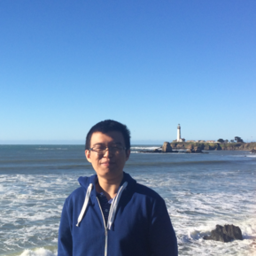

<!-- *Seeking Truth, Pursuing Innovation.* -->

## About me
I'm a Principal Applied Scientist working on multi-modal foundation models (video generation models in particular) at Amazon Artificial General Intelligence (AGI) org. In the past, I was with AWS AI Labs, and Meta Reality Labs where I worked on several initiatives on 3-D computer vision.

I defended my Ph.D. thesis on *Inertial-aided Visual Perception of Geometry and Semantics* in August 2019. From Sept. 2014 - Sept. 2019, I've been working at [UCLA Vision Lab][about_visionlab] with [Prof. Stefano Soatto][about_ss].

My research interests include computer vision, robotics, and machine learning. Specifically, I'm interested in developing models (include, but not limited to, deep learning models) and engineering systems to solve real-world problems in multi-sensor (and multi-modal) settings. 

Our paper *Geo-Supervised Visual Depth Prediction* about leveraging visual-inertial sensor packages, and gravity-induced shape priors to improve depth prediction has won the *Best Paper Award in Robot Vision* at ICRA 2019, out of 2900 submissions.

Before joining Vision Lab, I\'ve obtained my B.Eng. from [Zhejiang University][about_zju], Hangzhou, China, 2014. I majored in Information and Electronic Engineering in undergraduate, and it was my great pleasure to be a member of the Advanced honor Class of Engineering Education (ACEE), where I practiced a lot in mathematical modeling contests and enjoyed exchanging ideas with other engineering majors.

A recent CV is [available here][resume].

[resume]: {{site.url}}/assets/feixh.pdf

[about_zju]: http://www.zju.edu.cn/english/
[about_ucla]: http://www.ucla.edu
[about_ss]: http://www.cs.ucla.edu/~soatto/
[about_visionlab]: http://vision.ucla.edu

The video below shows [XIVO][xivo_code] -- our open-sourced VIO.
[][xivo_code]
<!-- [][xivo_code]
XIVO running on TUM-VI dataset. -->

## Awards & Distinctions

- Best Paper Award in Robot Vision, ICRA 2019.
- Meritorious Winner of Mathematical Contest in Modeling, 2013.
- National Scholarship, Ministry of Education, China.

## What's new
- December 2024. We launched Amazon Nova family of models -- Amazon's family of multi-modal foundation models. See it in [AWS news blog](https://aws.amazon.com/blogs/aws/introducing-amazon-nova-frontier-intelligence-and-industry-leading-price-performance/) and [the technical report](https://arxiv.org/abs/2506.12103).
- July 2021. Our paper on *Single View Physical Distance Estimation using Human Pose* ([pre-print][physical_distance_arxiv]) for the social distancing problem was accepted by ICCV 2021!
- February 2021. Our paper on *An Adaptive Framework for Learning Unsupervised Depth Completion* has been accepted by ICRA 2021.
- February 2020. Our paper on *Unsupervised Depth Completion from Visual-Inertial Odometry* has been accepted by ICRA 2020.
- September 2019. We open-sourced our VIO implementation, you can find the code [here][xivo_code].

## Software

- XIVO (X Inertial-aided Visual Odometry) or yet another visual-inertial odometry.\[[code][xivo_code]\]
- VISMA dataset and utilities for our ECCV paper on *Visual-Inertial Object Detection and Mapping*. \[[code][eccv18_data]\]
- GeoSup code for our ICRA paper on *Geo-Supervised Visual Depth Prediction*. \[[code][icra19_code]\]
- A minimal implementation of \\(SE(3)\\) \(actually \\(SO(3)\times \mathbb{R}^3 \\)\) in Tensorflow for geometric learning. \[[code](https://github.com/feixh/tensorflow_se3.git)\]
- A collection of PnP (Perspective-n-Point) RANSAC solvers. \[[code](https://github.com/feixh/PnPRANAAC.git)\]

[xivo_code]:https://github.com/ucla-vision/xivo

## Demo

- Visual-Inertial Navigation and Semantic Mapping System @ [CVPR 2016](http://cvpr2016.thecvf.com/program/demos).\\
  \[[video][cvpr16_demo_video]\]-\[[poster][cvpr16_demo_poster]\]
- Visual-Inertial Navigation, Mapping and Loop Closure @ [SCR 2016](http://socal-robotics.org/index.html).\\
  \[[video][video_vio_more]\]-\[[poster][poster_scr16_demo]\]
- Re-localization and Failure Recovery for SLAM.\\
  \[[video][video_relocalization]\]
  
<iframe width="640" height="480" src="https://www.youtube.com/embed/TZTriqQm6nU" frameborder="0" allow="autoplay; encrypted-media" allowfullscreen></iframe>

## Thesis 

- Ph.D. Thesis: Inertial-aided Visual Perception of Geometry and Semantics\\
    \[[manuscript][phd_thesis]\]-\[[slides][defense_slides]\]

[phd_thesis]: https://escholarship.org/content/qt9pd173p9/qt9pd173p9.pdf
[defense_slides]: https://www.dropbox.com/s/53hllw7mrxxmpn5/XiaohanFei_defense.pdf?dl=0 

- B.Eng. Thesis: Robust Wide-baseline Feature Matching for Panoramic Images\\
    <!-- \[[manuscript][beng_thesis]\] -->

[beng_thesis]: {{site.url}}

## Publication

- The Amazon Nova Family of Models: Technical Report and Model Card\\
\[[arXiv](https://arxiv.org/abs/2506.12103)\], 2024

- Towards visual foundational models of physical scenes\\
    Chethan Parameshwara, Alessandro Achille, Matthew Trager, Xiaolong Li, Jiawei Mo, Ashwin Swaminathan, CJ Taylor, Dheera Venkatraman, Xiaohan Fei, Stefano Soatto\\
    \[[arXiv](https://arxiv.org/pdf/2306.03727)\], 2023

- A Quantitative Evaluation of Score Distillation Sampling Based Text-to-3D\\
    Xiaohan Fei, Chethan Parameshwara, Jiawei Mo, Xiaolong Li, Ashwin Swaminathan, CJ Taylor, Paolo Favaro, Stefano Soatto\\
    \[[arXiv](https://arxiv.org/pdf/2402.18780)\], 2023

- Fast sparse view guided nerf update for object reconfigurations\\
    Ziqi Lu, Jianbo Ye, Xiaohan Fei, Xiaolong Li, Jiawei Mo, Ashwin Swaminathan, Stefano Soatto\\
    \[[arXiv](https://arxiv.org/pdf/2403.11024)\], 2023

- Grounded compositional and diverse text-to-3d with pretrained multi-view diffusion model\\
    Xiaolong Li, Jiawei Mo, Ying Wang, Chethan Parameshwara, Xiaohan Fei, Ashwin Swaminathan, CJ Taylor, Zhuowen Tu, Paolo Favaro, Stefano Soatto\\
    \[[arXiv](https://arxiv.org/pdf/2404.18065?)\], 2023

- Single View Physical Distance Estimation using Human Pose\\
    Xiaohan Fei, Henry Wang, Xiangyu Zeng, Lin Lee Cheong, Meng Wang, Joseph Tighe\\
    Accepted by *International Conference on Computer Vision* (ICCV), 2021\\
    \[[pre-print][physical_distance_arxiv]\]

- An Adaptive Framework for Learning Unsupervised Depth Completion\\
    Alex Wong, Xiaohan Fei, Byung-Woo Hong, and Stefano Soatto\\
    In *International Conference on Robotics and Automation*, 2021\\
    Also in *IEEE Robotics and Automation Letters* (RA-L), 2021\\
    \[[paper][icra21_paper]\]

- Unsupervised Depth Completion from Visual-Inertial Odometry\\
    Alex Wong\*, Xiaohan Fei\*,  Stephanie Tsuei, and Stefano Soatto\\
    In *International Conference on Robotics and Automation*, 2020\\
    Also in *IEEE Robotics and Automation Letters (RA-L)*, 2020\\
    \[[paper][icra20_preprint]\]-\[[code][icra20_code]\]-\[[data][icra20_data]\]-\[[void benchmark][void_benchmark]\]

- Geo-Supervised Visual Depth Prediction\\
    Xiaohan Fei, Alex Wong, and Stefano Soatto\\
    In *International Conference on Robotics and Automation*, 2019\\
    **(Best Paper Award in Robot Vision)** \\
    Also in *IEEE Robotics and Automation Letters (RA-L)*, 2019\\
    \[[paper][icra19_paper]\]-\[[poster][icra19_poster]\]-\[[slides][icra19_slides]\]-\[[code][icra19_code]\]

- Visual-Inertial Object Detection and Mapping\\
    Xiaohan Fei and Stefano Soatto\\
    In *Proceedings of European Conference on Computer Vision*, 2018\\
    \[[paper][eccv18_paper]\]-\[[poster][eccv18_poster]\]-\[[video][eccv18_video]\]-\[[data][eccv18_data]\]-\[[supmat][eccv18_supmat]\]

- Visual-Inertial-Semantic Scene Representation for 3D Object Detection\\
    Jingming Dong\*, Xiaohan Fei\*, and Stefano Soatto\\
    In *Proceedings of Computer Vision and Pattern Recognition*, 2017\\
    \[[paper][cvpr17_paper]\]-\[[poster][cvpr17_poster]\]-\[[video][cvpr17_video]\]

- A Simple Hierarchical Pooling Data Structure for Loop Closure\\
    Xiaohan Fei, Konstantine Tsotsos, and Stefano Soatto\\
    In *Proceedings of European Conference on Computer Vision*, 2016\\
    \[[paper][eccv16_paper]\]-\[[poster][eccv16_poster]\]

<!-- physical distance -->
[physical_distance_arxiv]:https://arxiv.org/abs/2106.10335

<!-- ICRA21 -->
[icra21_paper]:{{site.url}}/assets/adaptive_framework.pdf

<!-- ICRA20 -->
[icra20_preprint]:https://arxiv.org/abs/1905.08616
[icra20_code]:https://github.com/alexklwong/unsupervised-depth-completion-visual-inertial-odometry
[icra20_data]:https://github.com/alexklwong/void-dataset
[void_benchmark]:https://github.com/alexklwong/awesome-state-of-depth-completion

<!-- ICRA19 -->
[icra19_paper]: https://arxiv.org/abs/1807.11130.pdf
[icra19_poster]: https://docs.google.com/presentation/d/15iNPC1V6dx52CqyeNivtYySM-cqvE0ghAH9C8Tzd6yQ/edit?usp=sharing
[icra19_slides]: https://docs.google.com/presentation/d/1okyWsSpKIzcbfvCD8VkkuLlcV8cHKxxQKH4Xy2JSPOQ/edit?usp=sharing
[icra19_code]: https://github.com/feixh/GeoSup

<!-- ECCV18 -->
[eccv18_paper]: http://openaccess.thecvf.com/content_ECCV_2018/papers/Xiaohan_Fei_Visual-Inertial_Object_Detection_ECCV_2018_paper.pdf
[eccv18_poster]: https://www.dropbox.com/s/n0m5lsgodm99x5q/eccv18_poster.pdf?dl=0
[eccv18_video]: https://youtu.be/TZTriqQm6nU
[eccv18_data]: https://github.com/feixh/VISMA
[eccv18_supmat]: {{ site.url }}/assets/0533-supp.pdf

<!-- CVPR16 -->
[cvpr16_demo_video]: https://youtu.be/Rt2jdurowfE
[cvpr16_demo_poster]: https://www.dropbox.com/s/2c33vatb2lnoz0z/cvpr16_demo_poster.pdf?dl=0

<!-- CVPR17 -->
[cvpr17_paper]: http://openaccess.thecvf.com/content_cvpr_2017/papers/Dong_Visual-Inertial-Semantic_Scene_Representation_CVPR_2017_paper.pdf
[cvpr17_poster]: https://www.dropbox.com/s/0phis714b5pnagk/cvpr17_poster.pdf?dl=0
[cvpr17_video]: https://youtu.be/tbxQUXdiXKo

<!-- ECCV16 -->
[eccv16_paper]: https://arxiv.org/abs/1511.06489
[eccv16_poster]: https://www.dropbox.com/s/9w02c3sard5q0om/eccv16_poster.pdf?dl=0

<!-- SCR16 -->
[poster_scr16_demo]: https://www.dropbox.com/s/9rwdfw0c4kserkn/scr16_demo_poster.pdf?dl=0
[video_vio_more]: https://www.youtube.com/watch?v=H7mODetStyo

<!-- other -->
[video_relocalization]: https://youtu.be/oQKnOHGkwTIh
[video_pgo]: https://youtu.be/-sbvl6gCwgQ
[video_cooperative_mapping]: https://youtu.be/iicbK45IzLI

## Professional Services

Reviewer of major vision (CVPR, ICCV, and ECCV), and robotics (ICRA, IROS) conferences.

## Talk & Workshop
- *Inertial-aided Visual Perception for Localization, Mapping, and Detection*, at Facebook Reality Labs, Microsoft Research, and MagicLeap, 2019.
- *Visual-Inertial-Semantic Scene Representation*, at Bridges to 3D Workshop, CVPR 2017.

## Teaching
- Spring 2018. CS M152A, Introductory Digital Design Laboratory.
- In undergraduate, I was a TA of the graduate class taught by Prof. Xianyi Gong at Zhejiang University on Spectral Analysis of Signals -- mostly solving problem sets of the [*Linear Estimaion*](https://www.amazon.com/Linear-Estimation-Thomas-Kailath/dp/0130224642) book, and leading discussions.

<!-- google analytics -->

