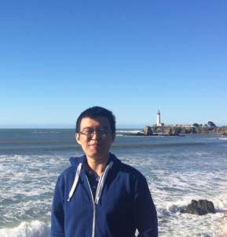
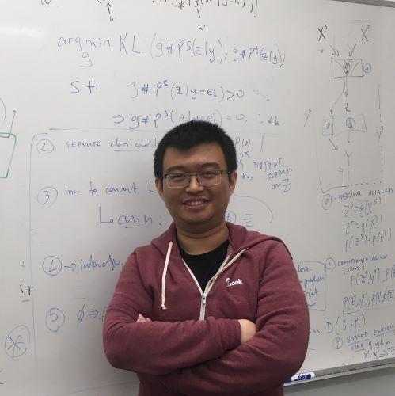

<!-- 
 -->
<!--  -->

<!-- 
 -->

## About me
I'm a PhD candidate at [UCLA Vision Lab][about_visionlab], working with [Prof. Stefano Soatto][about_ss]. I\'ve obtained my B.Eng. from [Zhejiang University][about_zju], China, 2014. During my undergraduate, I majored in Information and Electronic Engineering. My research interests include computer vision, robotics and machine learning.

A recent CV is [available here][resume].

[resume]: {{ site.url }}/assets/feixh.pdf

[about_zju]: http://www.zju.edu.cn/english/
[about_ucla]: http://www.ucla.edu
[about_ss]: http://www.cs.ucla.edu/~soatto/
[about_visionlab]: http://vision.ucla.edu

## Code & Data

- VISMA dataset and utilities for our ECCV paper on *Visual-Inertial Object Detection and Mapping*. \[[code](https://github.com/feixh/VISMA)\]
- GeoSup code for our ICRA paper on *Geo-Supervised Visual Depth Prediction*. \[[code](https://github.com/feixh/GeoSup)\]
- A minimal implementation of \\(SE(3)\\) \(actually \\(SO(3)\times \mathbb{R}^3 \\)\) in Tensorflow for geometric learning. \[[code](https://github.com/feixh/tensorflow_se3.git)\]
- A collection of PnP (Perspective-n-Point) RANSAC solvers. \[[code](https://github.com/feixh/PnPRANAAC.git)\]

## Demo

- Visual-Inertial Navigation and Semantic Mapping System @ [CVPR 2016](http://cvpr2016.thecvf.com/program/demos).\\
  \[[video][cvpr16_demo_video]\]-\[[poster][cvpr16_demo_poster]\]
- Visual-Inertial Navigation, Mapping and Loop Closure @ [SCR 2016](http://socal-robotics.org/index.html).\\
  \[[video][video_vio_more]\]-\[[poster][poster_scr16_demo]\]
- Re-localization and Failure Recovery for SLAM.\\
  \[[video][video_relocalization]\]
  
<iframe width="640" height="480" src="https://www.youtube.com/embed/TZTriqQm6nU" frameborder="0" allow="autoplay; encrypted-media" allowfullscreen></iframe>

<!-- SIGL -->
[geosup_paper]: https://arxiv.org/abs/1807.11130v3.pdf

## Publication

- Geo-Supervised Visual Depth Prediction.\\
    Xiaohan Fei, Alex Wong, Stefano Soatto\\
    To appear in *International Conference on Robotics and Automation*, 2019.\\
    Also in *IEEE Robotics and Automation Letters (RA-L)*, 2019.\\
    \[[paper][geosup_paper]\]

- Visual-Inertial Object Detection and Mapping.\\
    Xiaohan Fei, Stefano Soatto\\
    In *Proceedings of European Conference on Computer Vision*, 2018.\\
    \[[paper][eccv18_paper]\]-\[[poster][eccv18_poster]\]-\[[video][eccv18_video]\]-\[[data][eccv18_data]\]-\[[supmat][eccv18_supmat]\]

- Visual-Inertial-Semantic Scene Representation for 3D Object Detection.\\
    Jingming Dong\*, Xiaohan Fei\*, Stefano Soatto.\\
    In *Proceedings of Computer Vision and Pattern Recognition*, 2017.\\
    \[[paper][cvpr17_paper]\]-\[[poster][cvpr17_poster]\]-\[[video][cvpr17_video]\]

- A Simple Hierarchical Pooling Data Structure for Loop Closure.\\
    Xiaohan Fei, Konstantine Tsotsos, Stefano Soatto.\\
    In *Proceedings of European Conference on Computer Vision*, 2016.\\
    \[[paper][eccv16_paper]\]-\[[poster][eccv16_poster]\]

<!-- ECCV18 -->
[eccv18_paper]: http://openaccess.thecvf.com/content_ECCV_2018/papers/Xiaohan_Fei_Visual-Inertial_Object_Detection_ECCV_2018_paper.pdf
[eccv18_poster]: https://www.dropbox.com/s/n0m5lsgodm99x5q/eccv18_poster.pdf?dl=0
[eccv18_video]: https://youtu.be/TZTriqQm6nU
[eccv18_data]: https://github.com/feixh/VISMA
[eccv18_supmat]: {{ site.url }}/assets/0533-supp.pdf

<!-- CVPR16 -->
[cvpr16_demo_video]: https://youtu.be/Rt2jdurowfE
[cvpr16_demo_poster]: https://www.dropbox.com/s/2c33vatb2lnoz0z/cvpr16_demo_poster.pdf?dl=0

<!-- CVPR17 -->
<!-- [cvpr17_paper]: https://www.dropbox.com/s/g0ro1rddqnbsubt/cvpr17_paper.pdf?dl=0 -->
[cvpr17_paper]: http://openaccess.thecvf.com/content_cvpr_2017/papers/Dong_Visual-Inertial-Semantic_Scene_Representation_CVPR_2017_paper.pdf
[cvpr17_poster]: https://www.dropbox.com/s/0phis714b5pnagk/cvpr17_poster.pdf?dl=0
[cvpr17_video]: https://youtu.be/tbxQUXdiXKo

<!-- ECCV16 -->
[eccv16_paper]: https://arxiv.org/abs/1511.06489
[eccv16_poster]: https://www.dropbox.com/s/9w02c3sard5q0om/eccv16_poster.pdf?dl=0

<!-- SCR16 -->
[poster_scr16_demo]: https://www.dropbox.com/s/9rwdfw0c4kserkn/scr16_demo_poster.pdf?dl=0
[video_vio_more]: https://www.youtube.com/watch?v=H7mODetStyo

<!-- other -->
[video_relocalization]: https://youtu.be/oQKnOHGkwTIh
[video_pgo]: https://youtu.be/-sbvl6gCwgQ
[video_cooperative_mapping]: https://youtu.be/iicbK45IzLI

## Talk & Workshop
- *Inertial-aided Visual Perception for Localization, Mapping, and Detection*, at Facebook, Microsoft, and MagicLeap, 2019.
- *Visual-Inertial-Semantic Scene Representation*, at Bridges to 3D Workshop, CVPR 2017.

## Teaching
Spring 2018. CS M152A, Introductory Digital Design Laboratory.

<!-- google analytics -->

