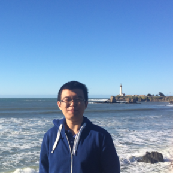

<!-- *Seeking Truth, Pursuing Innovation.* -->

## About Me

I'm a Principal Applied Scientist working on multi-modal foundation models (video generation models in particular) at Amazon Artificial General Intelligence (AGI) org. In the past, I was with AWS AI Labs, and Meta Reality Labs where I worked on several initiatives on 3-D computer vision.

I received my Ph.D. in Computer Science from UCLA in 2019, where I worked with [Prof. Stefano Soatto][about_ss] at the [UCLA Vision Lab][about_visionlab]. My dissertation, *Inertial-aided Visual Perception of Geometry and Semantics*, explored how inertial measurements can improve visual understanding of geometry and semantic structure.

My research spans computer vision, robotics, and machine learning. I am particularly interested in building models and systems that solve real-world problems by combining information across sensors and modalities.

Our paper *Geo-Supervised Visual Depth Prediction*, which uses inertial measurements and gravity-induced shape priors to improve monocular depth prediction, received the **Best Paper Award in Robot Vision** at ICRA 2019, selected from 2,900 submissions.

I received my B.Eng. in Information and Communication Engineering from [Zhejiang University][about_zju] in 2014. I was also a member of the Advanced Honor Class of Engineering Education at Chu Kochen Honors College, where I developed an enduring interest in mathematical modeling and interdisciplinary engineering.

My current CV is [available here][resume].

[resume]: {{site.url}}/assets/feixh.pdf

[about_zju]: https://www.zju.edu.cn/english/
[about_ss]: https://www.cs.ucla.edu/~soatto/
[about_visionlab]: https://vision.ucla.edu

## Awards & Distinctions

- Best Paper Award in Robot Vision, ICRA 2019.
- Meritorious Winner of Mathematical Contest in Modeling, 2013.
- National Scholarship, Ministry of Education, China.

## Demo

    <h3 class="demo-subtitle">Amazon Nova Video and Image Generation Models</h3>
    <figure class="demo-item">
        <iframe class="demo-media" src="https://www.youtube.com/embed/7BMTlC41-n8?playsinline=1" title="Amazon Nova Reel video generation demo" loading="lazy" allow="encrypted-media" allowfullscreen></iframe>
        <figcaption>Amazon Nova Reel video generation</figcaption>
    </figure>
    <figure class="demo-item">
        <iframe class="demo-media" src="https://www.youtube.com/embed/XX2XgHdJ_yM?playsinline=1" title="Amazon Nova Canvas image generation demo" loading="lazy" allow="encrypted-media" allowfullscreen></iframe>
        <figcaption>Amazon Nova Canvas image generation</figcaption>
    </figure>
    <h3 class="demo-subtitle">Multi-Sensor Localization and Mapping</h3>
    <figure class="demo-item">
        <iframe class="demo-media" src="https://www.youtube.com/embed/TZTriqQm6nU?autoplay=1&amp;mute=1&amp;playsinline=1" title="Visual-inertial object detection and mapping demo" allow="autoplay; encrypted-media" allowfullscreen></iframe>
        <figcaption>Visual-Inertial Object Detection and Mapping</figcaption>
    </figure>
    <figure class="demo-item">
        
        <figcaption><a href="https://github.com/ucla-vision/xivo">XIVO</a>, our open-source visual-inertial odometry system</figcaption>
    </figure>

### Additional Demo

- **Visual-Inertial Navigation and Semantic Mapping**, CVPR 2016 Demo: [[video][cvpr16_demo_video]] [[poster][cvpr16_demo_poster]]
- **Visual-Inertial Navigation, Mapping, and Loop Closure**, Southern California Robotics Symposium 2016: [[video][video_vio_more]] [[poster][poster_scr16_demo]]
- **Relocalization and Failure Recovery for SLAM**: [[video][video_relocalization]]

## What's New

- February 2026: Our paper *[InterPrior: Scaling Generative Control for Physics-Based Human-Object Interactions](https://arxiv.org/abs/2602.06035)* was accepted to CVPR 2026.
- December 2025: We launched the Amazon Nova 2 family of foundation models: Nova 2 Lite, Pro, Omni, and Sonic, spanning reasoning, multimodal understanding and generation, and real-time conversational AI. See the [press release](https://press.aboutamazon.com/2025/12/amazon-introduces-four-new-frontier-nova-models-a-pioneering-nova-forge-service-for-organizations-to-build-their-own-models-and-nova-act-for-building-reliable-browser-agents) and [technical report](https://www.amazon.science/publications/amazon-nova-2-multimodal-reasoning-and-generation-models).
- December 2024: We launched Amazon Nova, a new family of multimodal foundation models for understanding and generating text, images, and video. See the [press release](https://press.aboutamazon.com/2024/12/introducing-amazon-nova-a-new-generation-of-foundation-models), [AWS launch post](https://aws.amazon.com/blogs/aws/introducing-amazon-nova-frontier-intelligence-and-industry-leading-price-performance/), and [technical report](https://www.amazon.science/publications/the-amazon-nova-family-of-models-technical-report-and-model-card).
- September 2019: We released [XIVO][xivo_code], our open-source visual-inertial odometry implementation.

## Software

- XIVO (X Inertial-aided Visual Odometry) or yet another visual-inertial odometry. \[[code][xivo_code]\]
- VISMA dataset and utilities for our ECCV paper on *Visual-Inertial Object Detection and Mapping*. \[[code][eccv18_data]\]
- GeoSup code for our ICRA paper on *Geo-Supervised Visual Depth Prediction*. \[[code][icra19_code]\]
- A minimal implementation of \\(SE(3)\\) \(actually \\(SO(3)\times \mathbb{R}^3 \\) in Tensorflow for geometric learning. \[[code](https://github.com/feixh/tensorflow_se3.git)\]
- A collection of PnP (Perspective-n-Point) RANSAC solvers. \[[code](https://github.com/feixh/PnPRANAAC.git)\]

[xivo_code]:https://github.com/ucla-vision/xivo

## Theses

- **Ph.D., 2019:** *Inertial-aided Visual Perception of Geometry and Semantics* [[manuscript][phd_thesis]] [[slides][defense_slides]]
- **B.Eng., 2014:** *Robust Wide-Baseline Feature Matching for Panoramic Images*

[phd_thesis]: https://escholarship.org/content/qt9pd173p9/qt9pd173p9.pdf
[defense_slides]: https://www.dropbox.com/s/53hllw7mrxxmpn5/XiaohanFei_defense.pdf?dl=0

## Publications

* Equal contribution.

    <article class="publication-item">
        
        

            <h3><a href="https://arxiv.org/abs/2602.06035">InterPrior: Scaling Generative Control for Physics-Based Human-Object Interactions</a></h3>
            
Sirui Xu, Samuel Schulter, Morteza Ziyadi, Xialin He, <strong>Xiaohan Fei</strong>, Yu-Xiong Wang, and Liangyan Gui. <em>CVPR</em>, 2026.

            
InterPrior combines large-scale imitation pretraining with reinforcement-learning post-training to produce a versatile physics-based controller that follows sparse goals, recovers from failures, and generalizes human-object interactions to unseen settings.

        

    </article>

    <article class="publication-item">
        
        

            <h3><a href="https://cdn.amazon.science/c5/3d/84514a224666b5be6de4b43ef4aa/nova-2-0-technical-report2.pdf">Amazon Nova 2: Multimodal Reasoning and Generation Models</a></h3>
            
Amazon Artificial General Intelligence. Technical report, 2025.

            
Nova 2 introduces four foundation models spanning configurable reasoning, native multimodal understanding and generation, and real-time speech-to-speech interaction, with context windows of up to one million tokens.

        

    </article>

    <article class="publication-item">
        
        

            <h3><a href="https://cdn.amazon.science/96/7d/0d3e59514abf8fdcfafcdc574300/nova-tech-report-20250317-0810.pdf">The Amazon Nova Family of Models: Technical Report and Model Card</a></h3>
            
Amazon Artificial General Intelligence. Technical report, 2024.

            
The original Nova family pairs efficient text and multimodal understanding models with Canvas image generation and Reel video generation, emphasizing price-performance, customization, and responsible development.

        

    </article>

    <article class="publication-item">
        
        

            <h3><a href="https://arxiv.org/abs/2404.18065">Grounded Compositional and Diverse Text-to-3D with Pretrained Multi-View Diffusion Model</a></h3>
            
Xiaolong Li, Jiawei Mo, Ying Wang, Chethan Parameshwara, <strong>Xiaohan Fei</strong>, Ashwin Swaminathan, CJ Taylor, Zhuowen Tu, Paolo Favaro, and Stefano Soatto. <em>arXiv preprint</em>, 2024.

            
Grounded-Dreamer uses text-aligned four-view images as an intermediate representation, then combines sparse-view reconstruction with score distillation to generate faithful, diverse 3D assets from complex compositional prompts.

        

    </article>

    <article class="publication-item">
        
        

            <h3><a href="https://arxiv.org/abs/2403.11024">Fast Sparse-View Guided NeRF Update for Object Reconfigurations</a></h3>
            
Ziqi Lu, Jianbo Ye, <strong>Xiaohan Fei</strong>, Xiaolong Li, Jiawei Mo, Ashwin Swaminathan, and Stefano Soatto. <em>arXiv preprint</em>, 2024.

            
This method detects physical scene changes from as few as four new images and uses a helper NeRF to update local geometry and appearance in one to two minutes, avoiding full scene recapture and retraining.

        

    </article>

    <article class="publication-item">
        
        

            <h3><a href="https://arxiv.org/abs/2402.18780">A Quantitative Evaluation of Score Distillation Sampling Based Text-to-3D</a></h3>
            
<strong>Xiaohan Fei</strong>, Chethan Parameshwara, Jiawei Mo, Xiaolong Li, Ashwin Swaminathan, CJ Taylor, Paolo Favaro, and Stefano Soatto. <em>arXiv preprint</em>, 2024.

            
The work introduces human-validated metrics for the Janus problem, prompt alignment, and 3D realism, then uses the analysis to design an efficient Gaussian-splatting baseline that reduces common score-distillation artifacts.

        

    </article>

    <article class="publication-item">
        
        

            <h3><a href="https://arxiv.org/abs/2306.03727">Towards Visual Foundational Models of Physical Scenes</a></h3>
            
Chethan Parameshwara*, Alessandro Achille*, Matthew Trager, Xiaolong Li, Jiawei Mo, Ashwin Swaminathan, CJ Taylor, Dheera Venkatraman, <strong>Xiaohan Fei*</strong>, and Stefano Soatto*. <em>arXiv preprint</em>, 2023.

            
This paper formalizes what it means to represent a physical scene, explains why NeRFs alone cannot extrapolate beyond observed data, and explores diffusion priors as a mechanism for constructing more general visual representations.

        

    </article>

    <article class="publication-item">
        
        

            <h3><a href="https://arxiv.org/abs/2106.10335">Single View Physical Distance Estimation using Human Pose</a></h3>
            
<strong>Xiaohan Fei</strong>, Henry Wang, Xiangyu Zeng, Lin-Lee Cheong, Meng Wang, and Joseph Tighe. <em>ICCV</em>, 2021.

            
A direct pose-based formulation jointly estimates camera intrinsics, the ground plane, and distances between people from a fixed monocular camera, enabling metric measurements without manual calibration or range sensors.

        

    </article>

    <article class="publication-item">
        
        

            <h3><a href="{{ site.url }}/assets/adaptive_framework.pdf">An Adaptive Framework for Learning Unsupervised Depth Completion</a></h3>
            
Alex Wong, <strong>Xiaohan Fei</strong>, Byung-Woo Hong, and Stefano Soatto. <em>ICRA</em> and <em>IEEE Robotics and Automation Letters (RA-L)</em>, 2021.

            
The framework uses reconstruction residuals to adapt visibility and regularization weights across pixels and training time, improving existing unsupervised depth-completion methods without adding trainable parameters or inference cost.

        

    </article>

    <article class="publication-item">
        
        

            <h3><a href="https://arxiv.org/abs/1905.08616">Unsupervised Depth Completion from Visual-Inertial Odometry</a></h3>
            
Alex Wong*, <strong>Xiaohan Fei*</strong>, Stephanie Tsuei, and Stefano Soatto. <em>ICRA</em> and <em>IEEE Robotics and Automation Letters (RA-L)</em>, 2020.

            
The method turns sparse visual-inertial landmarks into a piecewise-planar scaffold and learns dense depth through cross-modal photometric, pose, and geometric consistency; it also introduces the VOID dataset.

            
<a href="https://github.com/alexklwong/unsupervised-depth-completion-visual-inertial-odometry">Code</a> · <a href="https://github.com/alexklwong/void-dataset">Data</a> · <a href="https://github.com/alexklwong/awesome-state-of-depth-completion">Benchmark</a>

        

    </article>

    <article class="publication-item">
        
        

            <h3><a href="https://arxiv.org/abs/1807.11130.pdf">Geo-Supervised Visual Depth Prediction</a></h3>
            
<strong>Xiaohan Fei</strong>, Alex Wong, and Stefano Soatto. <em>ICRA</em> and <em>IEEE Robotics and Automation Letters (RA-L)</em>, 2019. <strong>Best Paper Award in Robot Vision.</strong>

            
Gravity from inertial measurements and semantic shape priors supervise monocular depth during training, encouraging horizontal and vertical surfaces to follow known geometry and improving depth prediction across datasets.

            
<a href="https://docs.google.com/presentation/d/15iNPC1V6dx52CqyeNivtYySM-cqvE0ghAH9C8Tzd6yQ/edit?usp=sharing">Poster</a> · <a href="https://docs.google.com/presentation/d/1okyWsSpKIzcbfvCD8VkkuLlcV8cHKxxQKH4Xy2JSPOQ/edit?usp=sharing">Slides</a> · <a href="https://github.com/feixh/GeoSup">Code</a>

        

    </article>

    <article class="publication-item">
        
        

            <h3><a href="https://openaccess.thecvf.com/content_ECCV_2018/papers/Xiaohan_Fei_Visual-Inertial_Object_Detection_ECCV_2018_paper.pdf">Visual-Inertial Object Detection and Mapping</a></h3>
            
<strong>Xiaohan Fei</strong> and Stefano Soatto. <em>ECCV</em>, 2018.

            
An online monocular-inertial filter combines bottom-up detections with top-down object hypotheses to build a Euclidean map containing sparse geometry, recognized object models, and their poses; the work also introduces the VISMA dataset.

            
<a href="https://www.dropbox.com/s/n0m5lsgodm99x5q/eccv18_poster.pdf?dl=0">Poster</a> · <a href="https://youtu.be/TZTriqQm6nU">Video</a> · <a href="https://github.com/feixh/VISMA">Data</a> · <a href="{{ site.url }}/assets/0533-supp.pdf">Supplement</a>

        

    </article>

    <article class="publication-item">
        
        

            <h3><a href="https://openaccess.thecvf.com/content_cvpr_2017/papers/Dong_Visual-Inertial-Semantic_Scene_Representation_CVPR_2017_paper.pdf">Visual-Inertial-Semantic Scene Representation for 3D Object Detection</a></h3>
            
Jingming Dong*, <strong>Xiaohan Fei*</strong>, and Stefano Soatto. <em>CVPR</em>, 2017.

            
The system fuses visual-inertial geometry with CNN likelihoods into a persistent posterior over object identity and 3D pose, accumulating evidence over time and retaining objects through temporary occlusion.

            
<a href="https://www.dropbox.com/s/0phis714b5pnagk/cvpr17_poster.pdf?dl=0">Poster</a> · <a href="https://youtu.be/tbxQUXdiXKo">Video</a>

        

    </article>

    <article class="publication-item">
        
        

            <h3><a href="https://arxiv.org/abs/1511.06489">A Simple Hierarchical Pooling Data Structure for Loop Closure</a></h3>
            
<strong>Xiaohan Fei</strong>, Konstantine Tsotsos, and Stefano Soatto. <em>ECCV</em>, 2016.

            
Hierarchically pooling temporally adjacent bag-of-words descriptors accelerates large-scale loop-closure search by 4–20× on average while preserving nearly the same retrieval performance as more costly schemes.

            
<a href="https://www.dropbox.com/s/9w02c3sard5q0om/eccv16_poster.pdf?dl=0">Poster</a>

        

    </article>

<!-- physical distance -->
[physical_distance_arxiv]:https://arxiv.org/abs/2106.10335

<!-- ICRA21 -->
[icra21_paper]:{{site.url}}/assets/adaptive_framework.pdf

<!-- ICRA20 -->
[icra20_preprint]:https://arxiv.org/abs/1905.08616
[icra20_code]:https://github.com/alexklwong/unsupervised-depth-completion-visual-inertial-odometry
[icra20_data]:https://github.com/alexklwong/void-dataset
[void_benchmark]:https://github.com/alexklwong/awesome-state-of-depth-completion

<!-- ICRA19 -->
[icra19_paper]: https://arxiv.org/abs/1807.11130.pdf
[icra19_poster]: https://docs.google.com/presentation/d/15iNPC1V6dx52CqyeNivtYySM-cqvE0ghAH9C8Tzd6yQ/edit?usp=sharing
[icra19_slides]: https://docs.google.com/presentation/d/1okyWsSpKIzcbfvCD8VkkuLlcV8cHKxxQKH4Xy2JSPOQ/edit?usp=sharing
[icra19_code]: https://github.com/feixh/GeoSup

<!-- ECCV18 -->
[eccv18_paper]: http://openaccess.thecvf.com/content_ECCV_2018/papers/Xiaohan_Fei_Visual-Inertial_Object_Detection_ECCV_2018_paper.pdf
[eccv18_poster]: https://www.dropbox.com/s/n0m5lsgodm99x5q/eccv18_poster.pdf?dl=0
[eccv18_video]: https://youtu.be/TZTriqQm6nU
[eccv18_data]: https://github.com/feixh/VISMA
[eccv18_supmat]: {{ site.url }}/assets/0533-supp.pdf

<!-- CVPR16 -->
[cvpr16_demo_video]: https://youtu.be/Rt2jdurowfE
[cvpr16_demo_poster]: https://www.dropbox.com/s/2c33vatb2lnoz0z/cvpr16_demo_poster.pdf?dl=0

<!-- CVPR17 -->
[cvpr17_paper]: http://openaccess.thecvf.com/content_cvpr_2017/papers/Dong_Visual-Inertial-Semantic_Scene_Representation_CVPR_2017_paper.pdf
[cvpr17_poster]: https://www.dropbox.com/s/0phis714b5pnagk/cvpr17_poster.pdf?dl=0
[cvpr17_video]: https://youtu.be/tbxQUXdiXKo

<!-- ECCV16 -->
[eccv16_paper]: https://arxiv.org/abs/1511.06489
[eccv16_poster]: https://www.dropbox.com/s/9w02c3sard5q0om/eccv16_poster.pdf?dl=0

<!-- SCR16 -->
[poster_scr16_demo]: https://www.dropbox.com/s/9rwdfw0c4kserkn/scr16_demo_poster.pdf?dl=0
[video_vio_more]: https://www.youtube.com/watch?v=H7mODetStyo

<!-- other -->
[video_relocalization]: https://youtu.be/oQKnOHGkwTIh

## Professional Services

Reviewer for leading conferences in computer vision (CVPR, ICCV, ECCV), robotics (ICRA, IROS), and artificial intelligence (NeurIPS, ICLR, AAAI).

## Talks & Workshops

- *Inertial-aided Visual Perception for Localization, Mapping, and Detection*, Facebook Reality Labs, Microsoft Research, and Magic Leap, 2019.
- *Visual-Inertial-Semantic Scene Representation*, Bridges to 3D Workshop at CVPR, 2017.

## Teaching

- Teaching Assistant, CS M152A: Introductory Digital Design Laboratory, UCLA, Spring 2018.
- Teaching Assistant, Spectral Analysis of Signals, Zhejiang University. I led discussions and problem-solving sessions based in part on [*Linear Estimation*](https://www.amazon.com/Linear-Estimation-Thomas-Kailath/dp/0130224642).

<!-- google analytics -->

