## Deep Learning Meets Geometry

The idea behind this line of work is: We should take multi-view geometry into consideration, which is well studied but not fully explored in deep learning based frameworks.

### RayNet: Learning Volumetric 3d Reconstruction with Ray Potentials

CVPR 2018

<http://www.cvlibs.net/publications/Paschalidou2018CVPR.pdf>

- Problem: Depth estimation given multiple views and relative motion
- CNNs can handle large appearance variation but do not model the physics of image formation which is modelled by MRF with ray potentials
- RayNet: integrate a CNN (viewpoint invariant feature representations) with an MRF (explicityly model perspective projection and occlusion)
- Difficulties: Naive backpropagation through the unrolled MRF is intractable due to the large amount of messages needed to be stored during training
    - solution: Stochastic ray sampling approach allows efficient BP
    - MRF: act as regularizer and improve the output of both CNN and joint model
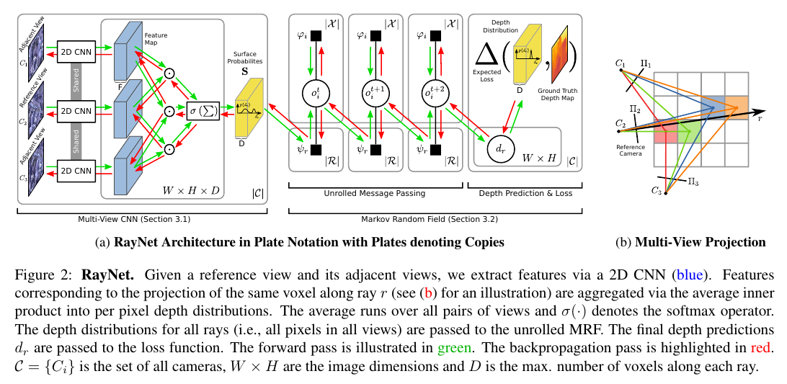
- MRF with ray potentials is unrolled as 3 layers since observation shows MRF usually converges after 3 iterations, notation and formulation are the following, for more details see Ulusoy's 3DV 15 paper.

**Ray Potential MRF Formulation**:

 Each voxel $i \in \Omega$ is assigned a binary occupancy variable $o_i$. Ordered set $\mathbf{o}_r\doteq(o_1^r, o_2^r,\cdots,o_{N_r}^r)$ denotes voxels interecting a single ray $r \in \mathcal{R}$. Joint distribution over all the occupancy variables $\mathbf{o}=\{o_i| i \in \Omega\}$ is:
 
$$
p(\mathbf{o})=\frac{1}{Z}\prod_{i \in \Omega} \phi_i(o_i) \prod_{r \in \mathcal R} \psi_r(\mathbf{o}_r)
$$

where the first term is unary potential encoding prior $\phi_i(o_i)=\gamma^{o_i}(1-\gamma)^{1-o_i}$ and the second term is ray potential $\psi_r(\mathbf o_r)\prod_{j \lt i} (1-o_j^r)s_i^r$ where $s_i^r$ is the probability of the visible surface along ray $r$ beging located at voxel $i$. $s_i^r$ is noisy prediction from CNN. Loss w.r.t. ground truth depth requires depth estimation extracted from occupancy states:

$$
d_r = \sum_{i=1}^{N_r} o_i^r \prod_{j \lt i} (1-o_i^r) d_i^r
$$

is the depth over the set of depth values $\mathbf{d}_r=\{d_1^r, \cdots, d_{N_r}^r\}$ corresponding to set occupancy grid set $\mathbf{o}_r$ associated with ray $r$.

 Loss: L1 loss relative to the GT depth.

- As an inference tool, can we use convex relaxation which probably doesn't require this unroll thing.

- From the experiments, it seems this approach is not significantly better than plance sweep with ZNCC/SAD (Christopher Hane real-time direct dense matching on fisheye images using plane-sweeping stereo, 3DV 14)?

<!-- 
- Related work:
    1. SurfaceNet: An End-to-end 3D Neural Network for Multiview Stereopsis. ICCV 17.
    2. Learned multi-patch similarity. ICCV 17.
    3. Towards probabilistic volumetric reconstruction using ray potentials. 3DV 15.
        - An old one, but 1st author A. O. Ulusoy has many good works on ray potential MRF.
    4. Learning a multi-view stereo machine. NIPS 17.
    Previous depth estimation network either 
        - doesn't consider the image formation process at all OR
        - makes use of projective geometry but **doesn't explicitly exploit occlusion relationships across viewpoints**
            - Multiple views are fed into a generic 3D CNN and the network directly maps multiple views to 3D reconstruction
        - all these methods require 3D supervision, to overcome various supervision signals are exploited
            - Tulsiani: Differentialable view consistency loss 
            - Rezende: Neural projection layer and black box renderer
            - Yan and Gwak: 2D silhouettes as supervision
        - RayNet imposes the physical constraints via MRF with ray potentials so that the network does not need to learn these constrains from data

-->

---

### Learning a Multi-View Stereo Machine

NIPS 2017

<https://arxiv.org/abs/1708.05375>

- Difference from other learning based reconstruction framework:
    - This one also exploits geometric cues of the underlying problem via projection/unprojection of features along viewing rays
    - Others solely rely on semantic cues such as 3D-R2N2
    - This method also uses geometric constraints during inference while others only use such cues in training -- such left-right consistency
- Showcase the system for object reconstruction -- objects are perfectly segmented and placed against white background
    - Compare to plane sweeping, visual hulls and other learnt stereo method
    - This method is able to reconstruct objects with fewer images than classical ones
    - And is able to better use camera pose (naive use of camera pose does not lead to expected gains) -- adding more views significantly improves performance
    - Generalize well to unseen object categories -- a benefit brought by geometric cues which is not fully explored in other learnt method

#### Method

- Overall pipeline:
    1. Produce dense feature maps $\{F_i\}_{i=1}^n$ for input images $\{I_i\}_{i=1}^n$
    2. Unproject the features into 3D feature grids $\{G_i\}_{i=1}^n$ by rastering the viewing rays with the known camera poses $\{P_i\}_{i=1}^n$
    3. Match the unprojected features using a recurrent neural network which processes the unprojected grids sequentially to produce a grid of local matching costs $G^p$
    4. Smooth the noisy cost volume $G^p$ by a 3D encoder-decoder network and generate a smoothed cost volume $G^o$. The encoder-decoder mimics an optimization framework with data and smoothness terms.
    5. The final output can be either a volumetric occupancy grid (Voxel LSM) or a grid of features whic is projected back into 2D feature maps $\{O_i\}_{i=1}^n$,  from which per view depth/disparity map can be constructed (Depth LSM).
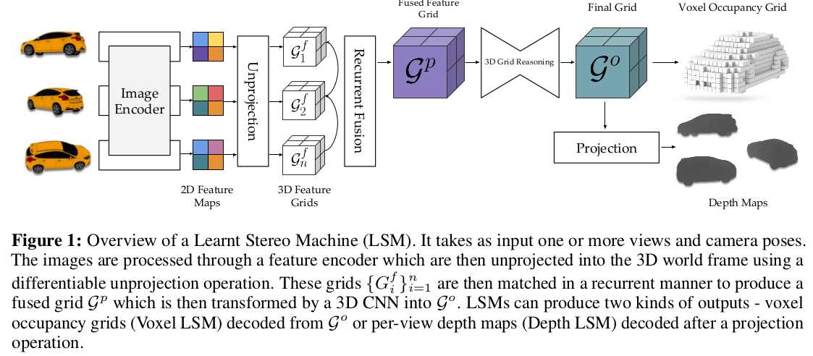

- Key components: differentiable projection/unprojection operators
- 2D Image Encoder: encoder-decoder network with skip connections (UNet) outputs feature maps given input images. 
- Differentiable Unprojection: 
    - Given the k-th voxel, first project its center in world frame $X_w^k$ onto image plane via the camera intrinsics $K$ and extrinsics $[R|t]\in\mathrm{SE}(3)$, i.e., $p_k'=K[R|t]X_w^k$.
    - Use differentiable bilinear sampling to sample from the discrete feature grid to obtain the feature at $X_w^k$.
    - Append depth value and ray direction at each sampling point so that surfaces can be infered even from a single image. (Impossible to match features if all one has is one image. By appending geometric features, one is essentially do single image depth estimation with both photometric and gometric features.)
- Recurrent Grid Fusion: Sequentially fuse 3D feature grids $\{G_i^f\}_{i=1}^n$ into one $G^p$ by a GRU, which *mimics incremental matching in MVS where the hidden state of the GRU stores a running belief about the matching scores by matching features in the observations it has seen*. 
    - Issue: as a sequential method the result depends on the order of input images. Randomly permute the input images and constrain the result to be the same to make network invariant to input order.
    - Other methods:  Point-wise function such as max or average (see PointNet) is spatially too local. Concatenating all feature grids to feed a CNN scales linearly with number of inputs and only works for fixed number of inputs.
- 3D Grid Reasoning: Once the 3D feature grids are fused into one $G^p$, a classical multi-view stereo appraoch would directly evaluate the photo-consistency at the grid locations by comparing the appearance of the individual views and extract the surface at voxels where the images agree. This step is modeled with a 3D UNet that transforms the fused grid $G^p$ to $G^o$. 
    - In the case of Voxel LSM where the final output is a 3D occupancy grid, the 3D UNet learns the mapping from feature grid to occupancy grid, which can be considered as $G^o$.
    - In the case of per view depth/disparity estimation, the 3D feature grid can be used in the following differentiable projection modules such that view-based representation can be infered.
- Differentiable Projection: Consider a certain view with parameters $K$ and $[R|t]\in \mathrm{SE}(3)$. For each viewing ray, uniformly sample its depth along the viewing direction (say we have n sampling point), stack the features along the channel dimension at the sampling point. $1\times 1$ convolution can be applied to the stacked features to reduce the dimension of features (projection) which are then used predict depth/disparity map.

#### Experiments

- Voxel grid resolution: $32 \times 32 \times 32$
- Input image size: $224 \times 224$
- Batch size: 4
- Each batch contains 4 views of an object

#### Reference
- [24, 4, 5] for GRU

---

### Factoring Shape, Pose, and Layout from the 2D Image of a 3D Scene

CVPR 18

<https://arxiv.org/abs/1712.01812>

- Widely used representation for 3D scenes are not sufficient. Both of view-specific depth/normal maps or voxel grid do NOT distinguish objects -- the representation lacks semantics.
    - View-specific depth/normal maps: Invisible surfaces are not represented.
    - Voxel grid: The shape and pose of objects are mixed together in voxel representation.
        - Why a factored representation of shape and pose is important? With such a representation, we can manipulate objects in the scene while keeping other factors untouched. For instance, we can rotate the chair, move the chair, without deforming its shape.
- Relation to other works:
    - RGB-D based shape completion: Geometry is freely available, and one only needs to infer the missing shapes. Much simpler.
    - CAD retrieval based methods: A dictionary of known shapes is available and one only needs to retrieve proper shapes and estimate its pose.
    - Other works which try to extend 2D detection to full 3D reconstruction: representation not as rich as this work. (mostly low-dimensional parametric shape)
- Proposed representation is comprised of *layout* and *objects*:
    - layout: scene surfaces that enclose the viewer, such as walls and floor, represented as full, amodal extent (what the scene would look like w/o objects)
    - objects: a discrete set of objects factored into 3D shape (voxels) and pose (rotation and translation).

#### Method
- Overall pipeline: One module to infer an amodal layout describing *the scene minus the object* and another object-centric module to map bounding boxes to object shape and pose.
- Layout: 
    - Treat layout as per pixel disparity estimation using skip-connected encoder-decoder architecture similar to [20] (FlowNet?)
        - Loss is l1 distance to ground truth. 
        - But in this paper, the layout is supposed to be amodal (like objects do not exist), is amodal ground truth available at all?
    - While previous methods estimate vanishing-point-aligned 3D box which cannot generalize to non-box setup.
- Object:
    - a anisotropic scaling $c$, quaternion $q$ and translation $t$ in a canonical frame.
    - An encoder-decoder network is applied to a coarse image to estimate disparity map as layout.
    - Three types of features are stacked together to estimate shape and pose:
        - Feature map corresponding to the whole coarse image as context
        - ROI pooling feature from the finest image resolution
        - Features from fully connected layers atop bonding box coordinates
    - The above stacked feature is used to estimate
        - shape: via another 3D encoder-decoder structure to estimate occupancy grid (binary cross-entropy loss, need bootstrap training [9]) $L_V$
        - scale: Euclidean distance of log scale $L_c$
        - translation: Euclidean loss $L_t$
        - rotation: quaternion, treat as classification, cross-entropy loss $L_q$
- Total loss: 

$$
\sum_{b\in \mathcal{B}^+} (L_V+L_q+L_t+L_c-\ln(f)) + \sum_{b\in \mathcal{B}^-}\ln(1-f)
$$

where $\mathcal{B}^+$ denotes foreground proposals and $f$ is the probability of a proposal being on foreground.

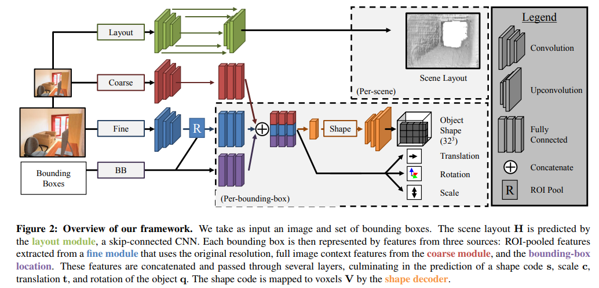

#### Experiments
- Train on SUNCG, which is synthetic and photo-realistic. Quantitative experiments are also performed on this dataset.
    - Restricted to a small set of interesting objects: bed, chair, desk, sofa, table and television.
- Also test on NYU v2 to show qualitative results.
- Results:
    - Rotation estimation as classification performs better than regression
    - Incorporating contextual feature (feature map from coarse image) is important for absolute scale and translation estimation, which *are hard to infer from a cropped image patch*.

---

### Learning Category-Specific Mesh Reconstruction from Image Collections

<https://arxiv.org/pdf/1803.07549.pdf>

- Representation:
    - Shape as a 3D mesh $M$ comprised of faces $F$ and vertices $V\in\mathbb{R}^{|V|\times 3}$, i.e., $M=(F, V)$. 
        - Connectivity of the mesh is pre-determined, i.e., $F=\mathrm{contant}$
        - Category-wise mean shape defined as $\bar V$
        - Instance-wise shape deformation defined as $\Delta V$
        - Thus full shape is $M=(F, \bar V+\Delta V)$
    - Camera pose defined as scale $s$, translation $t$ and quaternion $q$. 
    - Keypoints: Defined as $|K| \times |V|$ association matrix $A$, of which the k-th row denotes the probability distribution of a vertex being the k-th keypoint over all the vertices. 

- Training data $\{I_i, S_i, x_i, \tilde \pi_i\}_{i=1}^N$
    - an RGB image $I_i$ of an object, 
    - its 2D keypoints $x_i$ and 
    - the foreground mask $S_i$
    - also augmented with a weak projection $\tilde \pi_i$ which can be obtained via [11, 27]
- Network $f_\theta(\cdot)$ predicts the following quantities:
    - Mesh deformation $\Delta V$ in a canonical frame. Full mesh which will be constructed by adding the deformation to the mean shape $(F, \bar V)$.
    - Pose $(s, t, q)$ to bring the mesh from the canonical frame to camera frame.
    - Texture, which can be applied together with the mesh to generate a textured 3D object.
- Loss:
    - Instance specific loss contains two terms, one to penalize keypoint projection matching and another for misalignment of segmentation mask
        - Keypoint: $L_\text{reproj}=\sum_i{\| x_i - \tilde \pi_i(AV_i)\|_2}$
        - Mask: $L_\text{mask}=\sum_i{\|S_i - \mathcal{R}(V_i, F, \tilde \pi_i)\|_2}$, where $\mathcal{R}$ is a differentiable *Neural Mesh Render* [28]
        - Regression loss on camera pose: $L_\text{cam}\sum_i{\|\tilde \pi_i - \pi_i\|_2}$
    - Priors: 
        - Surface smoothness: $L_\text{smooth}\|LV\|_2$, where $L$ is the graph Laplacian operator.
        - Deformation regularization: the instance shape should not differ from the category mean too much, i.e., magnitude of instance deformation $\Delta V$ should be small, $L_\text{def}=\|\Delta V\|_2$
        - Keypoint association: the association matrix $A$ should give peaked distribution -> minimize the average entropy over all keypoints $L_\text{vert2kp}=\frac{1}{|K|}\sum_{k, v}-A_{k, v}\log A_{k, v}$
    - Total loss $L=L_\text{proj}+L_\text{mask}+L_\text{cam}+L_\text{smooth}+L_\text{def}+L_\text{vert2kp}$.
    - Symmetry constraints: imposed by the vertex connectivity $F$, pre-defined.
    - Shape initialized as convex hull.

    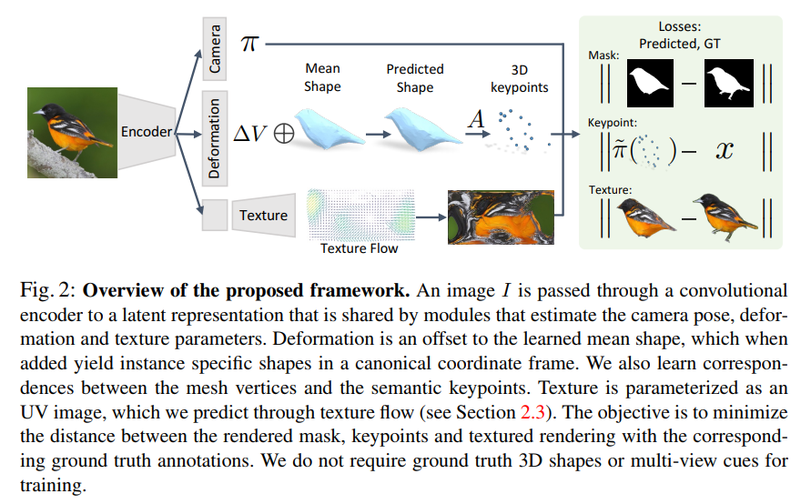
- Texture learning and experiments: see paper.

---

### Multi-view Consistency as Supervisory Signal for Learning Shape and Pose Prediction

CVPR 18.

<https://arxiv.org/pdf/1801.03910.pdf>

- Multi-view supervision with *unknown* pose
    - Previous multi-view object reconstruction methods require pose supervision 
- Essentially the setup is the same as the joint depth and ego-motion prediction problem, which is usually tackled on KITTI dataset. The equivalence can be established by checking the following:
    - In this work, occupancy grid is predicted, which is equivalent to depth estimation in the SLAM setting
    - In this work, the camera pose between different views is unknown -- the same as SLAM where one predict the ego-motion from consecutive frames
    - Though with different representations, the loss might differ 
- The related work section is quite informative. Three categories of related methods are mentioned: 
    1. generative 3d modeling without 3d supervision
    2. multi-view supervision for single-view depth prediction (two recent ones both in cvpr17:lr consistency, depth and ego-motion)
    3. multi-view supervision for single-view reconstruction(PTN and some others)
- Method:
    - two CNNs, one for shape $f_s(\cdot)$ and another for pose $f_p(\cdot)$
    - per-pixel differentiable ray consistency:

    $$
    L_p(\bar x, C; v_p) = \sum_{i=1}^{N} q_p(i) \psi_p(i)
    $$
    - where $\bar x$ is the predicted shape, $C$ is the camera pose, $v_p$ denotes the observation at pixel $p$. $\psi_p(i)$ denotes the cost for each event, determinted by $v_p$ and $q_p(i)$ indicates the event probability (the likelihood of the ray stopping at the i-th voxel in its path). The event probability is constructed using the probabilistic occupancy grid $\{x_p^i\}$. For details, see Appendix or the cvpr17 differentiable ray consistency paper.
    - sampling occupancies along a ray: to make the ray consistency also differentiable w.r.t. camera pose, one can do the following:
        1.  Sample distances along the ray determined by the pixel coordinates of the observation.
        2.  Construct 3D points $\{x_c\}$ based on the distance samples in the the current camera frame.
        3.  Apply the camera pose (or its inverse, dependent on how camera pose is defined) to bring the 3D sample points to the canonical object frame to obtain $\{x_o\}$. (Note, in this paper, shape is defined in a canonical frame)
        4.  Obtain values at $\{x_c\}$ by trilinearly interpolating values at $\{x_o\}$ in the canonical object frame.
- Loss: $L_\text{data}=\sum_{i=1}^N \sum_{u=1}^{N_i} \sum_{v=1}^{N_i} L(f_s(I_u^i), f_p(I_v^i); V_v^i)$ where $i$ is instance index; $u$ and $v$ are viewpoint indices and $V_v^i$ is the observation of instance $i$ at viewpoint $v$.
    - so essentially, for each training pair, shape is only predicted from $I_u$ and pose is only predicted from $I_v$. But since all possible pairs are considered, the network should learn both shape and pose prediction from images at viewpoints.
    - to avoid local minima in pose prediction:
        - apply prior on pose (now the loss involves the difference of prediction to pre-set pose in addition)
        - classification instead of regression on pose
- Parametrization:
    - rotation parametrized as azimuth and elevation
- Main references:
    - [13] Unsupervised 3d shape induction from 2d views of multiple objects. 3DV, 2017.
    - [36] Rethinking reprojection: Closing the loop for pose-aware shape reconstruction from a single image. ICCV, 2017.

---

### Neural 3D Mesh Renderer

CVPR 18.

<https://arxiv.org/pdf/1711.07566.pdf>

- What is the most appropriate representation for the 3D world?
    - voxels: most widely used due to its regular data structure and suitable for 3D convolutions, resolution is limited due to high memory deman
    - point cloud: good scability, lack topology (no surface modeling, makes it hard to model texture)
    - polygon mesh: compactness (surfaces are explicitly modeled, no need for enormous amount of samples) and suitability for geometric transformation (only manipulation of vertices is involved)
- Difficulty of using polygon mesh representation for learning:
    - Rasterization is not differentiable
        - Is this true? As long as visible vertices are projected to the image plane, other object properties can be obtained by running a per-pixel interpolation algorithm in barycentric coordinates defined by each triangle. Interpolation is, obviously, differentiable. However, the process of determining visibility is not differentiable.

#### Method
- Representation: a set of vertices in object frame $\{v_i^o\}_{i=1}^{N_v}$, where $v_i^o \in \mathbb{R}^3$, and a set of faces $\{f_i\}_{i=1}^{N_f}$, where $f_i \in \mathbb{N}^3$. Vertices then can be transformed to screen space $\{v_i^s\}$, where $v_i^s \in \mathbb{R}^2$ by Euclidean transformation and perspective projection.
- The paper proposed a method to approximate the gradient $\frac{\partial I}{\partial x}$ by investigating two 1D cases. However, it seems this is just like the standard method:
    - Apply Gaussian kernels first to blur the sharp boundaries of rendering 
    - Apply finite difference to compute the gradients
    - How different is this one from OpenDR?
- Single image 3D reconstruction:
    - Base shape: isotropic sphere with 642 vertices
    - Vertex $v_i+b_i+c$ where $v_i$ is the base vertex, $b_i$ is local bias and $c$ is global bias
    - Vertices are constrained to move within their original quadrant
    - Loss contains two terms: one term to compare the rendered silhouette and ground truth silhouette, $L_{sl}(x|\phi_i, s_i)=-\frac{|s_i \odot \hat s_i|_1}{|s_i + \hat s_i - s \odot \hat s_i|_1}$ -- binary intersection over union; the other to regularize prediction by enforcing smoothness: $L_{sm}=\sum_{\theta_i\in\mathcal E}(\cos\theta_i+1)^2$ where $\theta_i$ is the angle between two faces which share the same edge $i$.
- **Need to understand the gradient approximation in details.**

- Reference:
    - Early work use OpenGL in network training: 23
    - Single image 3D reconstruction:
        - via depth estimation: 4, 25
        - directly predict 3D shapes (voxel grids): 2, 5, 30, 31, 34
    - Similar work: PTN, with voxel representation [36]

---

### Multi-view supervision for single-view reconstruction via differentiable ray consistency

CVPR 17

- Introduction & Related work are useful, come back later
- Representation
  - Shape Representation: 3D shape representation is parametrized as occupancy (misnomer, actually the probability of being empty) probabilities of cells in a discretized 3D voxel grid, denoted by the variable $x$. Discretization of the 3D space not necessarily to be uniform -- as long as it's possible to trace rays across the voxel grid and compute intersections with cell boundaries.
  - Observation: treat various types of observations alike, including depth images, foreground masks, etc. Observation-camera pair $(O, C)$ -- observation $O$ is measured by camera $C$.
- View-consistency loss: $L(x; (O, C))$. Given the camera intrinsics, we can convert the constraint provided by each pixel of observation $O$ to a constraint of a specific ray $r$, which passes through the corresponding pixel. $L(x; (O, C))=\sum_r L_r(x)$. *The task for formulating the view consistency loss is simplified to defining a differentiable ray consistency loss $L_r(x)$.*
- Ray-tracing in a probabilistic occupancy grid:
  - Motivation: *The probabilistic occupancy model induces a distribution of events that can occur to ray $r$ and we can define $L_r(x)$ by seeing the incompatibility of these events with the available observation $o_r$.*
  - Ray termination events: random variable $z_r$ denotes the voxel in which the ray terminates.
  - $z_r=i$ iff the previous voxels in the path are all un-occupied and the $i$-th voxel is occupied, probability distribution of $z_r$:

  $$
  p(z_r=i)=
  \begin{cases}
  (1-x_i^r)\prod_{j=1}^{i-1}x_j^r, &i \le N_r\\
  \prod_{j=1}^{N_r}x_j^r, &i=N_r+1
  \end{cases}
  $$

  where event $z_r=N_r+1$ means the ray doesn't terminate -- ray goes into to empty space.
- Per-ray consistency loss:
  - Given depth observations:

  $$
  \psi_r^{\text{depth}}(i)=|d_i^r-d_r|
  $$

  where $d_i^r$ is the dpeth computed from the grid index $i$. Also we have an associated probability for $p(z_r=i)$ which is given above.
  - Given foreground mask:$s_r\in \{0, 1\}$ where 0 denotes object mask and 1 otherwise.

$$
\psi_r^{\text{mask}}(i)=
\begin{cases}
s_r, &i \le N_r\\
1-s_r, & i=N_r+1
\end{cases}
$$

- Ray consistency loss:

  $$
  \begin{aligned}
  L_r(x) &= \mathbb{E}_{z_r}[\psi_r(z_r)]\\
  &=\sum_{i=1}^{N_r+1}\psi_r(i)p(z_r=i)
  \end{aligned}
  $$

- Derivatives of loss w.r.t. CNN predictions $x$: see appendix.
- Further reading: [16, 26, 31] detailed reconstruction.
  - Hierarchical Surface Prediction for 3D Object Reconstruction
  - OctNetFusion
- TODO: study the code. (in lua, should be fun.)

---

### Unsupervised Learning of Depth and Ego-Motion from Video

CVPR 17

- [10, 14, 16] seem quite related. Differences: previous work requires relative camera motion during training, while this work produces camera motion as one of the outputs.
  - [10] DeepStereo: Learning to predict new views from the world's imagery.
  - [14] Unsupervised CNN for single view depth estimation: Geometry to the rescue.
  - [16] Unsupervised monocular depth estimation with left-right consistency.
- [14] requires pose supervision; [7] Eigen's single-view depth estimation paper: requires full depth supervision.
- concurrent work: SfM-Net: Learning of structure and motion from video. Differences: SfM-Net explicitly solves for object motion while this work discounts regions undergoing motion, occlusion and other factors via *explainability mask*.
- While a single-view depth CNN and a camera pose estimation CNN are jointly trained from unlabeled video sequences, the resulting depth model and the pose estimation model can be used independently during inference.
- Training samples: short image sequences of scenes captured by a moving camera; scene structure should be mostly rigid and static.
- View synthesis objective:

$$
  L_{vs}=\sum_s\sum_p|I_t(p)-\hat I_s(p)|
$$

  where $\hat I_s$ is the source view $I_s$ warped to the target coordinate frame based on predicted depth image $\hat D_t$ and camera motion $\hat T_{t\rightarrow s}$. Differentiable rendering module [8].
- Warping from target pixel location $p_t$ to source view $p_s$:

$$
p_s \sim K\hat T_{t\rightarrow s}\hat D_t(p_t) K^{-1}p_t
$$

where $K$ is camera intrinsic matrix.

- To handle cases where the assumptions of static scene, no-occlusion and Lambertian surfaces dont hold, train a *explainability prediction* network to mask out target-source pairs by the per-pixel soft masks $\hat E_s$. Weighted view synthesis loss:

$$
L_{vs}=\sum_{<I_1, \cdots, I_N>} \sum_p \hat E_s(p)|I_t(p)-\hat I_s(p)|
$$

where trivial solution exists which is $\hat E_s$ always being zero. Introduce regularization term $L_{reg}(\hat E_s)$ that *encourages nonzero predictions by minimizing the cross-entropy loss with constant label 1 at each pixel location*.

- Gradient locality: gradients are mainly derived from the pixel intensity difference, which will be problematic if
  - the correct projection is located in a low-texture region
  - the current estimate is far away from the correct one
- Two ways to handle gradient locality:
  - use convolutional encoder-decoder archticture with a small bottleneck for the depth network that implicitly constrains the output to be globally smooth and facilitates gradients to propagate from meaningful regions to nearby regions.
  - explicit multi-scale and smoothness loss [14, 16] that allows gradients to be derived
- Single-view depth prediction as a module in the whole system is adopted from DispNet[35]. Also look at [47] DeMoN.
- **Camera motion estimation outperforms ORB-SLAM running on short sequences without relocalization & loop closure, especially in the case of forward motion -- quite intrigering result!!!**

- [PyTorch implementation](https://github.com/ClementPinard/SfmLearner-Pytorch)

---

### Perspective Transformer Nets: Learning Single-View 3D Object Reconstruction without 3D Supervision

Simple approach, well written.

NIPS 2016

<https://arxiv.org/abs/1612.00814>

- The paper showed that it's feasible to train a single network for multi-class 3D object volumetric reconstruction without using ground truth 3D volumetric data for training
- Image of an object is the entanglement of its intrinsic (shape, color, texture, etc.)  and extrinsic (viewpoint, illumination, etc.) properties. The purpose of understanding 3D objects is to disentangle intrinsic and extrinsic properties from a single image.

#### Method

- Notation: Image $I^{(k)}$ at k-th viewpoint is $I^{(k)}=P(X; \alpha^{(k)})$ where $\alpha^{(k)}$ encodes the viewpoint parameters. Use voxel grid as 3D representation: state of i-th voxel grid $V_i \in \{0, 2\}$. 2D silhouette $S^{(k)}$ can be obtained via segmentation in practice, but in is trivial to obtain in this paper due to the white background assumption. 3D-2D projection: $S^{(k)}=P(V; \alpha^{(k)})$.
- Model: Encoder-decoder network to predict the state of voxels: $\hat V = f(I^{(k)})$. Encoder $h(\cdot)$ learns a viewpoint-invariant representation $h(I^{(k)}$ and decoder generates the volume $\hat V=g(h(I^{(k)}))$. 
- Perspective Transformation: One wants to compute the target volume $U=\{x_i^t, y_i^t, z_i^t\}_{i=1}^{H'\times W'\times D'}$ given the source volume $V=\{x_i^s, y_i^s, z_i^s\}_{i=1}^{H\times W\times D}$ and the source to target transformation $\Theta\doteq K[R | t]$. Given a target location $X_i^t$ defined in 3D discrete grid, we can first find its source location via $X^s=\Theta^{-1}X^t$ which has 3 real valued components and compute its value via linear interpolation: 

$$
    U_i=\sum_{n}^H \sum_{m}^W \sum_{l}^D V_{nml} \max(0, 1-|x_i^s-m|) \max(0, 1-|y_i^s-n|) \max(0, 1-|z_i^s-l|).
$$
- Basically, the interpolated value $U_i$ at $X_i^t$ is determined by the 8 vertices of the enclosing cube of its source location $X_i^s$.
- Projection is done by taking the maximum along the viewing direction. Since as long as there is at least one non-zero voxel intersecting the viewing direction, the pixel on image plane should be hit.

$$
S_{n'm'}=\max_{l'} U_{n'm'l'}
$$ where 

- Loss:
    - If 3D volumetric ground truth $V$ is available: $L_{vol}(I^{(k)})=\| f(I^{(k)}) - V\|_2^2$
    - Otherwise, use 2D silhouette as supervision: 

$$
    L_{proj}(I^{(k)})=\sum_{j=1}^n L_{proj}^{(j)}\big( I^{(k)}; S^{(j)}, \alpha^{(j)}\big)=\frac{1}{n}\sum_{j=1}^n \| P(f(I^{(k)}); \alpha^{(ij)}) - S^{(j)}\|_2^2
$$

- Two-stage training (to overcome training difficulty): train the decoder first (this can be done w/o PTN and solely on 2D images) and then train the decoder with PTN. Essentially, the decode should learn a viewpoint-invariant representation of objects, which can be learned via normal object recognition scheme.

---

### Unsupervised Learning of 3D Structure from Images

NIPS 16

<https://arxiv.org/pdf/1607.00662.pdf>

- Related work:
  - traditional vision as inverse graphics [24,21,23] (mostly from Josh Tenebaum's group) analysis-by-syntehesis [28,34,19,35] rely on heavily engineered visual features with simplified inference objectives 
  - some limitations are addressed by recent work [19,5,4,37] by learning part of the encoding-decoding pipeline
  - this paper is different from previous ones in the sense that:
    - first 3D representation learned *end-to-end* directly from 2D images *without supervision*

#### Conditional Generative Models

- Notations:
  - Observed volume or image $x$
  - A context $c$ which is available in both training and inference time. 3 forms of conditions are considered in experiments:
    - nothing
    - an object class label or 
    - one or more views of the scene from different viewpoints
  - The objective is to infer a 3D representation $h$ either in the form of a 3D volume or a mesh, which is enabled by modeling the latent manifold of object shapes and poses via the low-dimensional code $z$.
- Generative models with latent variables describe probability densities $p(x)$ over datapoints $x$ implicitly (why implicitly? since we can sample from it but do not know the exact form of the distribution) through a marginalization of the set of latent variables $z$, $p(x)=\int p_\theta(x|z) p(x) dz$.
- The marginal likelihood $p(x)$ is intractable and approximations are resorted, such as variational inference, where the marginal likelihood $p(x)$ is bound by $\mathcal{F}=\mathbb{E}_{q(z|x)}[\log p_\theta(x|z)] - KL[q_\phi(z|x) \| p(z)]$ where the true posterior is approximated by a parametric family of posterior $q_\phi(z|x)$ with parameters $\phi$. Variational parameters $\phi$ and model parameters $\theta$ are found jointly.
- We can think of the generative model as a decoder of the latent variables, and the inference network as an encoder of the observed data into the latent representation.
- Gradients of $\mathcal{F}$ can be estimated using reparametrization trick. [14,18] Kingma
- Need to read the DRAW paper first to understand this one. Seems in terms of architecture, this paper follows the DRAW paper and only briefly touches it here.
	- FIXME: ***DRAW: A recurrent neural network for image generation. ICML, 2015.***

---

### Octree generation networks: Efficient convolutional architectures for high-resolution 3d outputs

ICCV 2017

<https://arxiv.org/pdf/1703.09438.pdf>

- Related work:
    - supervised [15,6,8,18] and 
    - unsupervised [38,13,20] 3D object reconstruction
    - probabilistic generative models [37,36,30]
    - segmentation [3,5]
    - shape deformation [40]
    - inspired by sparse convolution papers [16,17]
    - similar idea: OctNet [29]

#### Octree Representation

- Instead of the naive implementation of pointers-to-childen to maintain the recursive structure, use hash tables to achieve constant query time.
- An octree cell with spatial coordinates $x\in\mathbb{R}^3$ at level $l$ is represented as an index-value pair $(m, v)$ where $v$ can be any kind of discrete or continuous signal and $m$ is computed from $(x, l)$ using *Z-order curves*[14]: $m=\mathcal{Z}(x, l)$, which is computationaly cheap due to its use of bit shifts. 
- An octree $O$ is a set of all pairs $O\doteq\{(m, v)\}$. Storing this set as a hash table allows for constant-time random access.
- Compare values at the same spatial location in two octree trees $O^1$ and $O^2$. Say we want to compare the value at $(x, l)$ in $O^1$ which has index $Z(x, l)$ to the value at same location in $O^2$. If there exists a cell $(x, k)$ with $k <= l$ in $O^2$, we obtain the value immediately, since in $O^2$, the whole block, which contains $(x, l)$, at level $k$, which is coarser than $l$, has the same value. If $l > k$, we cannot obtain the value at $(x, l)$ in $O^2$ unless we further subdivide the block $(x, l)$ in $O^1$. A function $f$ is introduced for querying the signal value of an arbitrary cell with index $m=\mathcal{Z}(x, l)$ from octree $O$:

$$
f(m, O) = 
\begin{cases}
v, \quad \text{if} k \le l: (\mathcal{Z}(x, k), v) \in O\\
\emptyset, \quad \text{otherwise}
\end{cases}
$$

- Feature maps are representeted as a set of features indexed by the hash function. Each cell has 3 possible states: empty, mixed and filled, each means the cell is not used at all, the cell should be subdivided and the whole cell is filled. This is mostly useful in training, where the predicted octree is compared to the ground truth octree: those cells whose divisions are consistent in two and filled in ground truth are marked as filled, those empty in ground truth are marked as emtpy. Both states are back-propagated such that the division scheme can be learned from the ground truth (actually no need for furtuer division, but label the cell correctly). For those cells which have different granualities of division in prediction and ground truth are marked as mixed. The mixed state is also back-propagated such the proper division (here, this is real division instead of changing states) can be learned.
- For loss and more details, come back to this paper if needed. Authors provide implementation integrated to Caffe.
- This is really fundamental data structure and low level implementation.

---

### Learning a probabilistic latent space of object shapes via 3d generative-adversarial modeling

<https://arxiv.org/pdf/1610.07584.pdf>

NIPS 16

- In terms of 3D voxel decoder, similar to DC-GAN (Radford, 2016).
- In terms of 3D-VAE-GAN, similar to VAE-GAN (Larsen, 2016).
- Losses:
    - $L_\text{3D-GAN}=\log D(x) + \log (1-D(G(z)))$, where $x$ is a real image, $z$ is the latent representation, $G$ is the convolutional generator which generates the voxel-based shape, $D$ is the discriminator which should give high score to fake samples and low score to real samples. Intuitively, generator $G$ tries to generate a as realistic as possible sample to confuse the discriminator and the discriminator tries to distinguish fake from real. So to minimize this loss, the $D$ is trained in such a way that it scores lower to real samples. For the second log to be lower, D(G(z)) should be higher meaning D should distinguish fake samples generated by G which tries to make the fake samples realistic.
    - $L_\text{KL}=D_\text{KL}\big(q(z|y)||p(z)\big)$ uses a distribution family $q(z|y)$ to approximate the true marginal $p(z)$ and we want to minimze their KL divergence.
    - $L_\text{recon}=\|G(E(y)) - x \|_2$ where $y$ is the input image and $E$ encodes the image into a latent representation.

- Main references:
    - FIXME: (DC-GAN) Unsupervised representation learning with deep convolutional generative adversarial networks. ICLR, 2016.
    - FIXME: (VAE-GAN) Autoencoding beyond pixels using a learned similarity metric. ICML, 2016.

---

### MarrNet: 3D Shape Reconstruction via 2.5D Sketches

<http://marrnet.csail.mit.edu/papers/marrnet_nips.pdf>

NIPS 17

- Reconstruct the shape of an object from a single image with two steps:
    1. Compute a 2.5D sketch including depth map, normal map and silhouette from the image
    2. Reconstruct the shape from the 2.5D sketch as voxel grid.
- Advantages of the two-step approach compared to direct method (predict shape directly from image):
    1. 2.5D sketches are easier to be recovered from a 2D image compared to 3D shapes
    2. 3D reconstruction from 2.5D sketches can be learned purely from synthetic data. Since rendering 2.5D sketches wihtout modeling object appearance variations including lighting, texture, etc., is much easier, which also *relieves the domain adaption problem*.
    3. A differentiable projective functions from 3D shape to 2.5D sketches is proposed so that the system can be trained end-to-end. (similar to DRC paper)
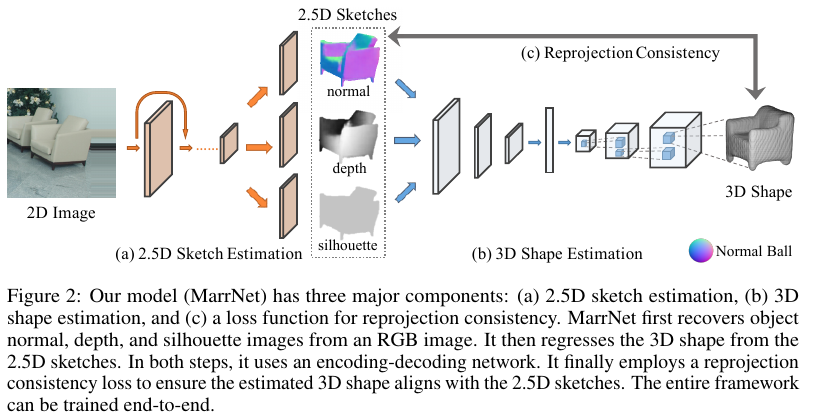
- Reprojection consistency:
    - Notations: Random variable $v_{x,y,z} \in [0,1]$ denotes the probability of voxel at $(x,y,z)$ being occupied. $d_{x,y}$ denotes the predicted depth at position $(x,y)$ and $n_{x,y}=(n_a,n_b,n_c)$ the predicted surface normal. Assume orthographic projection (compared to perspective projection, no need to scale x and y by depth z).
    - Depth consistency: Given a predicted depth $d_{x,y}$ at pixel coordinates $(x,y)$, we can trace the viewing ray and all the voxels along the ray should NOT be occupied, otherwise they should be penalized. For those voxels behind $d_{x,y}$, simply ignore them since they are invisible to which no assumptions can be made.

$$
L_\text{depth}=
\begin{cases}
v_{x,y,z}^2, \quad z<d_{x,y}\\
(1-v_{x,y,z})^2, \quad z=d_{x,y}\\
0, \quad z>d_{x,y}
\end{cases}
$$
    - Surface normal consistency: For a predicted surface normal $n_{x,y}=(n_a, n_b, n_c)$ to be meaningful, its neighboring voxels should sit on the same plane. We can simply check nearby voxels along the directions orthogonal to the normal, which are $n'_x=(0, -1, n_b/n_c)$ and $n'_y=(-1, 0, n_a/n_c)$. The normal consistency loss is then

$$
L_\text{normal}(x,y,z)=(1-v_{(x,y,z)+n'_x})^2 + (1-v_{(x,y,z)-n'_x})^2 + (1-v_{(x,y,z)+n'_y})^2 + (1-v_{(x,y,z)-n'_y})^2
$$
    - For the gradients of depth and surface normal consistency, see the paper.
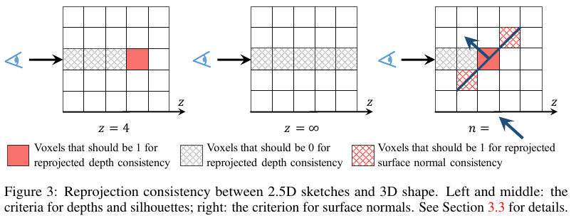

- Training: 2-stage scheme:
    1. the 2.5D sketch estimator and 3D shape predictor are trained separately on synthetic images with ground truth normal/depth/silhouette and voxels respectively. Cross-entropy loss is used for training of the shape predictor.
    2. the network is fine-tuned on real images.
- Comments: The intuition is really good -- training a system to directly predict 3D shapes from RGB images on synthetic data is challenging due to the complex image formation process where one has to model such that all the nuisance variability present in real images are also present in synthetic images. By the two-step formulation, one can rely on RGB-D data for training the 2.5D sketch predictor and synthetic data for training the 2.5D to 3D predictor, where one only needs to model geometric information, i.e., depth, normal and silhouette which are very easy to obtain.
- Main references:
    - (3d shape encoder) Learning a predicatable and generative vector representation for objects. ECCV, 2016.
    - (3d shape decoder) 3D-VAE-GAN

---

### Pix3D: Dataset and Methods for Single-Image 3D Shape Modeling

<https://arxiv.org/pdf/1804.04610.pdf>

CVPR 18

- Pix3D: a large-scale benchmark for diverse image-shape pairs with pixel-level 2D-3D alignment
    - 395 3D shapes of 
    - 9 object categories
    - 10069 image-shape pairs with precise 3D annotation: pixel-level alignment between shapes and their 2D silhouettes
- problems of existing 2D-3D datasets:
    - ShapeNet: purely synthetic, no real imagery
    - Pascal 3D and ObjectNet3D: rough image-shape alignment, with inexact shape model
    - IKEA: high-quality 3D alignment, scale too small
- steps to construct the dataset
    1. collect image-shape pairs by web crawling and performing 3D scans
    2. collect 2D keypoint annotations on Amazon Mechanical Turk with which 3D poses are optimized to align shapes with image silhouettes 
    3. filter out image-shape pairs with pool alignment and collect attributes (truncation, occlusion) for each instance also via crowdsourcing
- calibrate widely used metrics for shape alignment: 
    - IoU (Intersection over Union)
    - CD (Chamfer Distance): $CD(\Omega_1, \Omega_2)=\frac{1}{|\Omega_1|}\sum_{x \in \Omega_1} \min_{y \in \Omega_2}\| x-y\|_2 + \frac{1}{|\Omega_2|}\sum_{y \in \Omega_2}\min_{x\in\Omega_1}\|x-y\|_2$ 
    - EMD (Earth Mover's Distance [12]): $EMD(\Omega_1, \Omega_2)=\frac{1}{|\Omega_1|}\min_{\phi:\Omega_1\rightarrow\Omega_2}\|x-\phi(x)\|_2$. Expensive to compute and use the approximation [3]
    - Key findings: CD and EMD correlates better with human perception. See Table 1 and 2 where alignment with high IoU is not accepted by humans as good alignment.
- Comparison: 3DR2N2, Differentialble Ray Consistencyt (Berkley CVPR17), Jiajun NIPS15
    - Their approach: extension of MarrNet [61]
    - MarrNet for 2.5D sketch prediction as encoder: depth, normal and silhouette prediction
    - Attach decoder to MarrNet and predict: voxel grid of objects and viewpoints.
    - Training: 
        - render objects from ShapeNet, 3 types of backgrounds: 1/3 white, 1/3 high-dynamic-range with illumination channels, 1/3 on randomly sampled images from SUN
        - train MarrNet first and then train MarrNet and the decoders jointly
- Main reference:
    - FIXME: 61 **MarrNet: 3D Shape Reconstruction via 2.5D Sketches, NIPS 17.**
- Misc Notes: For detailed network architecture and qualitative results, see the SupMat.

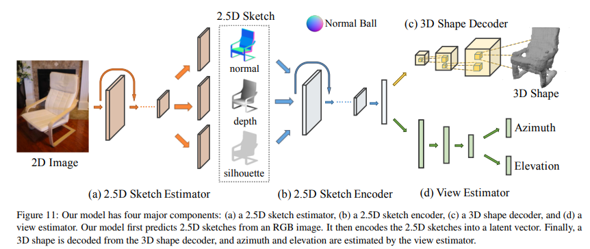

---

### Pixels, voxels, and views: A study of shape representations for single view 3D object shape prediction

<http://www.ics.uci.edu/~fowlkes/papers/sfh-shapecompletion.pdf>

CVPR 18

- Compare *surface* and *volumetric* 3D object representations in *view-centric* and *object-centric* frames
- Design a network to predict depth from either single depth or RGB image and adapt the network to produce surface/volumetric representations
- Key findings:
    1. surface-based methods outperform voxel representations for objects from *novel* classes and produce higher resolution outputs
    2. using view-centric coordinates is advantageous for novel objects (makes sense since in view-centric coordinates, reconstruction is view-specific and there is no need to learn viewpoint invariant representation which requires the object being seen before)
    3. while object-centric representations are better for more familiar objects (for familiar objects, the network should be able to learn a viewpoint invariant representation and predict class-specific shapes in a canonical frame where prior about the shape learned from shapes belonging to the same class can be used)
    4. the coordinate frame significantly affects the shape representation learned: 
    5. object-centric representation places more importance on implicitly recognizing the object category (this observation is consistent with 3)
    6. view-centric representations have less dependence on category recognition
- Network architecture:
    - Input can be either a depth/silhouette pair or a single RGB imageo
    - The network follows a typical encoder-decoder structure. For the depth/silhouette type inputs, each stream goes into a decoder ($E_d$ and $E_s$). The two feature maps are concatenated and fed to a third decoder $E_h$ which produces a feature map $h$ shared by a collection of decoders, each of which consists of a FC + UpConv structure, producing a silhouette and two (font and back) depth images at different viewpoints.
    - For multi-surface representation, Floating Scale surface Reconstruction (FSSR) [6] is appied to fit surfaces to the predicted depth map from different viewpoints.
    - For voxel representation, the decoders above are replaced by several 3D upconvolutional layers such that the feature map $h$ is decoded into a voxel representation.
- FIXME: There are some questions we need to ask ourselves:
    1. Can we directly predict parameters of a parametrized shape instead of predicting multi-view depth first?
    2. If we are given multiple images from different viewpoints, can we directly estimate parametrized shapes?
- Main references:
    - [6] Floating Scale Surface Reconstruction, TOG, 2014
    - [13] Completing 3D object shape from on depth image. CVPR 2015.

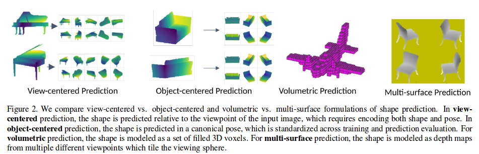
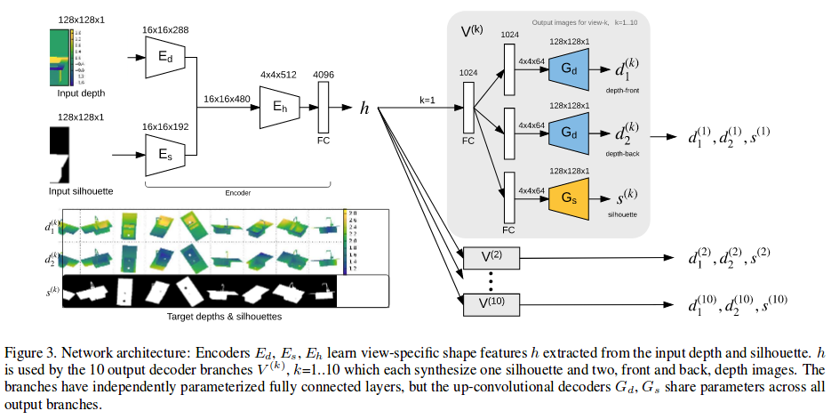

---

### Im2Struct: Recovering 3D Shape Structure from a Single RGB Image

<https://kevinkaixu.net/papers/niu_cvpr18_im2struct.pdf>

CVPR 18

- Recover 3D shape structures from single RGB image where *structure refers to shape parts represented by cuboids and part relations encompassing connectivity and symmetry*
- Encoder-deconder structure where:
    - the encoder is a multi-scale convolutional network 
        - trained with the task of shape contour estimation (essentially forground/background segmentation in the setting of this work where objects have non-homogeneous but simple background)
    h
    - the decoder fuses 
        1. the features of the encoder and 
        2. the original image
    - the two networks are trained jointly using 
        1. contour-mask and 
        2. cuboid-structure pairs which are generated by rendering repository of 3D CAD models coming with *part segmentation*.
- Structure Masking Network:
    - Inspired by [12] multi-scale network for detailed depth estimation
    - the first scale captures the information of the whole image
    - the second scale produces a detailed mask map at a quater of the input resolution
    - feature maps from the first scale are fed to the second scale via skip connections
- Structure Recovery Network:
    - **Feature fusion** from two channels:
        1. the feature map of the strcutre masking network (factor out nuisance variability, such as background clutters, texture and illumination changes)
        2. VGG feature from original image (provides complimentary information missing in mask)
    - **Structure decoding** vai recursive neural network (RvNN) as *box structure decoder* as [13]
        - RvNN: starting from a root node, recursively decodes its into a hierarchy of features until reaching the leaf nodes which each can be further decoded into a vector of box parameters
        - 3 types of node:
            1. leaf node (box decoder)
            2. adjacency node (adjacency decoder)
            3. symmetry node (symmetry decoder)
        - The latter two serve as internal notes indicating part relations. Each type of nodes requires a decoder (small network) to estimate parameters.

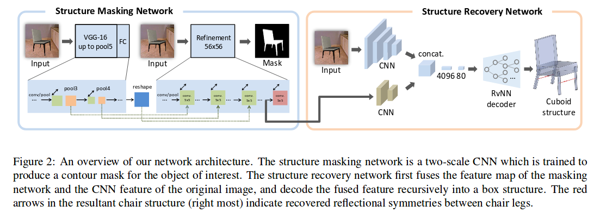
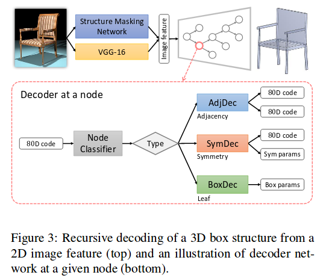

- Main references:
  - [12]for the 2 scale structure mask network
  - FIXME [13]box structure decoding: Grass: Generative recursive autoencoders for shape structures.
  - [22]jiajun, nips16: Learning a probabilistic latent space of object shapes via 3D generative-adversarial modeling.

---

### Attentional ShapeContextNet for Point Cloud Recognition

<http://vcl.ucsd.edu/~sxie/pdf/cvpr_2018_shape_context.pdf>

CVPR 18

The goal is to handle the irregular domain of point cloud data. Unlike images and depth maps which are defined on regular grids, point cloud data have irregular domain and vanilla convolution cannot capture the context effectively. This paper borrows the idea from handcrafted shape context descriptors, and comes up with trainable Shape Context blocks which are then put together to build a ShapeContextNet (SCN) and Attentional ShapeContextNet (A-SCN), where ideas of self-attention are borrowed from NLP to build the latter.

Experiments show better performance than PointNet and comparable performance to the recent PointNoet++ paper in terms 2D point cloud classification (on MNIST), part segmentation (ShapeNet part) and scene segmentation (Standford Scene).

---

### A Variational U-Net for Conditional Appearance and Shape Generation

<https://arxiv.org/pdf/1804.04694.pdf>

CVPR 18

- Good references to GAN and VAE:
    - GAN: [1,8,10,27,38]
    - VAE: 16, 31
    - Combination: [2,17]
- Other useful references:
    - perception similarity: [7] Photographic image synthesis with cascaded refinement networks. ICCV, 2017.
    - pix2pix: [12] Image-to-image translation iwth conditional adversarial networks. CVPR, 2016.
    - Autoencoding beyond pixels using a learned similarity metric. arXiv, 2015.
- Misc: The goal is to disentagle geometry (shape, pose) and appearance(texture, color)
    - The paper proposed a variational U-Net for this purpose.
    - Need to review VAE and come back to understand Section 3.

---

### ** PointGrid: A Deep Network for 3D Shape Understanding

<>

---

### Learning to Estimate 3D Human Pose and Shape from a Single Color Image 

<>

---

### * 3D Object Detection with Latent Support Surfaces

<http://cs.brown.edu/~ren/publications/cvpr2018/3dlatent_cvpr2018.pdf>

RGB-D and non-deep learning.

---

### Reconstructing Thin Structures of Manifold Surfaces by Integrating Spatial Curves

---

### Learning Less is More - 6D Camera Localization via 3D Surface Regression

---

### 3D Registration of Curves and Surfaces using Local Differential Information

---

### GeoNet: Geometric Neural Network for Joint Depth and Surface Normal Estimation

<http://www.cs.toronto.edu/~rjliao/papers/CVPR_2018_GeoNet.pdf>

CVPR 18

- GeoNet (Geometric Neural Network)
    - jointly predict depth and surface normal maps from a single image
    - built atop two-stream CNNs -- one stream for depth prediction and one for normal
    - *depth-to-normal* and *normal-to-depth* networks incorporate geometric relation between the two streams
- Terminologies: 
    - direct outputs from depth/normal networks are called initial depth/normal
    - final outputs after refinement are called refined depth/normal
    - normal computed from initial depth is called rough normal
- Depth-to-normal network: given initial depth prediction, compute per pixel rough surface normal via the following steps:
        1. convert the initial depth map to a point cloud
        2. compute rough normal prediction as the direction along which the coordinates of 3D points have least variance (in the paper, a least square solution is proposed, which is equivalent to applying SVD to the covariance of 3D points and find the vector with least singular value)
        3. refine the rough normal via a small network which consists of conv layers and skip connections from both the rough normal and initial normal prediction
- Normal-to-depth network: given initial normal prediction we can constrain the depth in a neighborhood in a way such that:
    - along the direction of normal, the variance of the 3D points formed by the depth is minimized
    - such constraints are applied to each pixel and smoothed via a linear kernel 
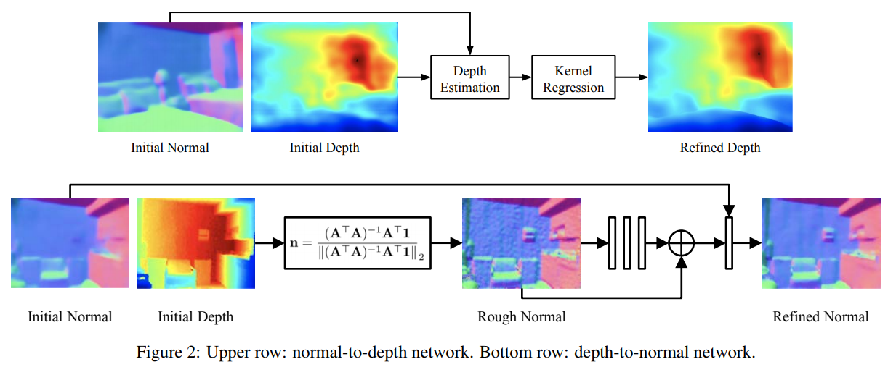
- Loss: 
    - $L_\text{depth}=\frac{1}{M}\big(\sum_i\|z_i - z_i^\text{gt}\|_2^2 + \mu \sum_i \|\hat z_i - z_i^\text{gt}\|_2^2\big)$
    - $L_\text{normal}=\frac{1}{M}\big(\sum_i\|n_i - n_i^\text{gt}\|_2^2 + \lambda \sum_i \|\hat n_i - n_i^\text{gt}\|_2^2\big)$
    - where quantities with hat is refined (final) prediction, with superscript gt is ground truth and without any decoration is rough prediction 
- Misc:
    - For ground truth depth with missing/invalid values, run inpainting method of [17] to fll in values
        - Colorization using optimization. ToG, 2014
    - Ground truth normal can be obtained from GT depth by using method of [9]
        - Data-driven 3D primitives for single image understanding. ICCV, 2013.
    - Least Square of normal computation is numerically instable due to the matrix inversion step, which can be mitigated by setting small value for $\lambda$.
- Main reference:
    - prior art: [16] Deeper depth prediction with fully convolutional residual networks. 3DV, 2016.
    - use semantics in geometric estimation: [19] Single image depth estimation from predicted semantic labels. CVPR, 2010.
    - FIXME: most similar [32]: SURGE: Surface regularized geometry estimation from a single image. NIPS, 2016.

---

### CodeSLAM --- Learning a Compact, Optimisable Representation for Dense Visual SLAM 

<https://arxiv.org/pdf/1804.00874.pdf>

CVPR 18

- Motivation
    - dense reconstruction cannot be fully probabilistic due to the large amount of parameters
        - correlation between depth reconstruction among nearby pixels is NOT modeled (in LSD-SLAM, per pixel Kalman filter is used to estimate semi-dense depth maps but correlation between pixels is not considered)
        - Also it's infeasible to jointly optimize motion and structure with such parametrization.
    - sparse reconstruction can be formulated in a fully probabilistic framework. In both filtering and graph optimization methods, joint posterior of motion and structure given all the observation can be maintained:
        - In filtering approach, the posterior is explicitly maintained by updating mean and covariance of a Gaussian distribution.
        - In graph optimization approach, one usually attain a point estimate by maximizing the posterior.
        - But sparse method only models a tiny portion of the underlying scene.
- *The conclusion that a dense representation of the environment requires a large number of parameters is NOT necessarily correct.* The geometry of natural scenes is not a random collection of *occupied and unoccupied* space but exhibits a high degree of order.
    - Locally in a depth map, nearby pixels should have similar depth values 
    - More strongly, a high-level (semantic) understanding of the scene can help decompose the scene into 
        - a set of semantic objects together with
        - some intrinsic parameters of each object (SLAM++ like representation)
    - Knowledge about primitive shapes such as planar surfaces can also be incorporated into SLAM.
    - Such representations are much more compact compared to voxel representation and they are more detailed compared to sparse representation.
- Representation: A compact but dense representation of scene geometry which is 
    - conditioned on the intensity data from a single image and 
        - conditioning: image provides local details and the code supplies more global shape priors
        - in reality the condiitoning is realized by concatenating RGB image features from an image decoder and depth features from a depth decoder.
    - generated from a code consisting of a small number of parameters.
        - this is achieved by a decoder detailed in Fig. 3 of the paper.
- In training time, two encoder-decoder networks based on the U-Net architecture are trained:
    - One is an image autoencoder whose decoder outputs uncertainty of per pixel depth prediction.
    - The other is a depth map autoencoder. For the depth encoder, image features from image decoder are concatenated to depth features with same spatial size and compressed. In the connection between encoder and decoder, there is a variational module. (see VAE paper) The decoder outputs per pixel mean depth.
    - Given the predicted uncertainty and mean, a cost involving log likelihood of depth is formulated. The paper didn't explicitly give the loss, I dont know why, but they referred to the NIPS 17 paper.
- In inference, depth map is not available which is OK, since essentially what one needs is the function to map the code to depth map and the the code as well as the relative poses of images are jointly optimized in a second-order optimization framework just like what people do in traditional SfM.
- The energy function in inference is essentially a function of the relative motion between two frames and the code (depth map in traditional formulation) and one obtains the solution by minimizing reconstruction error which is essentially the photometric difference of two images of which one warped to the other according to the relative pose and depth decoded from the code (thats why we only need the decoder in inference).
- So why do they use VAE in the network? The code given by VAE hopefully disentangles essential factors which can be used to reconstruct the scene and by searching a solution in the code space (carried out by optimization in inference), one can find a plausible dense reconstruction of the scene.
- Misc: Jacobians of the energy w.r.t. relative translation, rotation and the compact code, see the paper.
- Main refereces:
    - FIXME: use uncertainty in learning: [12] What uncertainties do we need in bayesian deep learning for computer vision. NIPS 17.
    - the VAE paper

---

### ** Deep Marching Cubes: Learning Explicit Surface Representations

---

### ** End-to-end recovery of Human Shape and Pose

CVPR 18

<https://arxiv.org/pdf/1712.06584.pdf>

---

### **PlaneNet: Piece-wise Planar Reconstruction froma Single RGB Image

---

### **Image Collection Pop-up: 3D Reconstruction and Clustering of Rigid and Non-Rigid Categories

---

### **Extreme 3D Face Reconstruction: Looking Past Occlusions

### 

---

## Mapping and Planning

### Unifying Map and Landmark Based Representations for Visual Navigation

<https://arxiv.org/pdf/1712.08125.pdf>

---

### Cognitive Mapping and Planning for Visual Navigation

<https://arxiv.org/abs/1702.03920>

## SLAM Meets Deep Learning

### Unsupervised Learning of Depth and Ego-Motion from Monocular Video Using 3D Geometric Constraints 

CVPR 18

<https://arxiv.org/pdf/1802.05522.pdf>

- Main contribution: explicitly consider the inferred 3D geometry of the scene, enforcing consistency of the estimated 3D point clouds and ego-motion across consecutive frames
    - Directly penalize inconsistencies in the estimated depth without relying on BP
    - The validity mask is analytically computed rather than learned from data. **comments: only out-of-view invalidity is considered here. In learning based validity mask prediction, occlusion and moving objects are also considered.**
    - Learn from an uncalibrated video stream
- The novel loss induced by ICP:
    - $D_{t-1}$ and $D_t$: depth maps of two consecutive frames, from which two points can be constructed
    - $Q_{t-1}$ and $Q_t$: corresponding point clouds by unprojection, represented in local camera frame
    - Apply the estimated ego-motion $T_t\doteq T_{t-1\leftarrow t}$ we get two roughly aligned point clouds $\hat Q_{t-1}\doteq T_t Q_t$
    - Optimal transformation $T'_t$ between the pair $(Q_{t}, \hat Q_{t-1})$ can be found via ICP
    - We penalize two things:
        - Ideally $T'_t$ should be identity matrix if the ego-motion prediction $T_t$ is perfect, thus we penalize its discrepancy to identity $\| T'_t - I\|_1$  
        - The point distance residual associated with the optimal transformation is also incorporated into the loss $\|r_t\|_1$
        - The total 3D loss is $L_\text{3D}=\|T'_t-I\|1+\|r_t\|_1$
        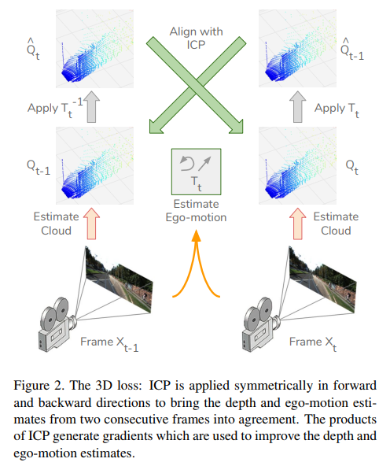
- Photometric losses widely used in other depth prediction papers are also used:
    - SSIM (structure similarity) loss $L_\text{SSIM}$
    - Disparity smoothness loss weighted by image gradient $L_\text{smooth}$
    - Reconstruction loss (photometric error) $L_\text{rec}$ same as $L_\text{ap}$ in the left-right consistency paper.
    - For details about these losses, see the left-right consistency paper. 

---

### V2V-PoseNet: Voxel-to-Voxel Prediction Network for Accurate 3D Hand and Human Pose Estimation from a Single Depth Map

<https://arxiv.org/pdf/1711.07399.pdf>

CVPR 18

- Existing works take a single 2D depth map and directly regresses the 3D coordinates of keypoints, which have two weaknesses:
    1. presence of perspective distortion: The depth map is essentially 3D data, however when project the 3D shape to the image plane, perspective distortion is introduced to the depth map. The network is compelled to learn away such perspective distortion, which can be avoided if we feed volumetric data instead.
    2. direct 3D coordinates regression from a 2D image is a highly non-linear mapping, which causes difficulty in the learning procedure.
- This paper casts the 3D hand and human pose estimation problem from a single depth map into a voxel-to-voxel prediction that uses a 3D voxelized grid and estimates the per-voxel likelihood for each keypoint.
- The method, though simple, outperforms prior art on almost all the benchmarks.

---

### Real-Time Monocular Depth Estimation using Synthetic Data with Domain Adaptation via Image Style Transfer

<http://breckon.eu/toby/publications/papers/abarghouei18monocular.pdf>

CVPR 18

---

### MegaDepth: Learning Single-View Depth Prediction from Internet Photos

<https://arxiv.org/pdf/1804.00607.pdf>

CVPR 18

- Use multi-vew Internet photo collections to generate training data via modern structure-from-motion (SfM) and multi-view stereo (MVS) methods, and present MegaDepth -- a large depth dataset.
    - Motivation: learning based methods need pairs of RGB image and depth map, which is difficult to collect:
        - RGB-D: restricted to indoor scenes
        - Laser scanners: sparse depth and hard to operate
        - crowdsourcing: only for sparse ordinal relations or surface normals (Weifeng's work)
    - Difficulty: there are some hard cases for SfM and MVS (take COLMAP as the underlying MVS system)
        - dynamic objects (people, cars, etc.): cannot establish reliable correspondences for SfM or MVS
        - noisy depth discontiinuities: object boundaries
        - bleeding of background depths into foreground objects: in classic formulation of SfM and MVS, depth estimation is regularized to be consistent (smooth) which can be achieved by consistently predicting the background depth.
    - Ways to overcome bad preliminary depth reconstruction from COLMAP:
        1. prefer less training data over bad data training data: throw away outlier depth maps
        2. utilize semantic segmentation (PSPNet CVPR17 is used) to enhance and filter the depth maps, and to yield large amounts of ordinal depth comparisons as additional training data.
- Depth enhancement via semantic segmentation
    - Images with high-quality depth reconstruction (with high fraction of valid depth reconstruction) are used for training of Euclidean depth.
    - Images with potentially big regions of dynamic objects (such as people, cars) are used to learn ordinal depth relationships.
- Network: VGG, ResNet and hourglass (HG) architectures are compared -- HG performs best
- Loss:
    - Depth reconstruction from SfM and MVS are up to a scale, use scale-invariant loss from Eigen and Fergus:
        $$
        L_\text{data}=\frac{1}{n}\sum_{i=1}^n (R_i)^2 - \frac{1}{n^2}\big(\sum_{i=1}^n R_i\big)^2
        $$
    where n is the number of valid depths in the ground truth depth map. $R_i=L_i - L_i^*$ is the difference of log-depth between prediction $L_i$ and ground truth $L_i^*$. This loss is essentially the empirical variance of the log-depth difference.
    - Multi-scale scale-invariant gradient matching term: to encourage smooth depth prediction and preserve sharp depth discontinuties at object boundaries.
    
    $$
    L_\text{grad}=\frac{1}{n}\sum_{k}\sum_{i}(|\nabla_x R_i^k| +|\nabla_y R_i^k|)
    $$
    where k indicates scale level.
    - Robust ordinal depth loss:
    
    $$
    L_\text{ord}=\begin{cases}
    \log(1+\exp(P_{ij})), &\quad\text{if } P_{ij} \le \tau\\
    \log(1+\exp(\sqrt{P_{ij}}))+c, &\quad\text{if } P_{ij} > \tau
    \end{cases}
    $$
    where $P_{ij}=-r_{ij}^*(L_i-L_j)$ and $r_{ij}^*$ is the ground truth ordinal depth relation between i and j (r=1 if i is further than j and -1 otherwise) and c is a constant to ensure $L_\text{ord}$ is continuous.

-

- Main references:
    - multi view 3d model learning: [26] Learning 3d object categories by looking around them. ICCV, 17.
    - multi view scene depth estimation: Demon: Depth and Motion network for learning monocular stereo. CVPR, 17.

---

### Learning Depth from Monocular Videos using Direct Methods

<https://arxiv.org/pdf/1712.00175.pdf>

CVPR 18

- Previous works on learning based joint pose and depth prediction has two separate modules: one pose predictor and one depth predictor, though trained jointly, the geometric relation between the two is not fully explored.
    - the pose network might be unnecessary and sub-optimal compared to the proposed method.
- Essentially, given two images and the depth prediction, one can find the optimal relative pose upto the precision of the depth prediction by minimizing the photometric error directly which is what direct visual odometry (DVO) does.
    - To enable direct optimization of pose, the paper introduces a differentiable direct visual odometry (DDVO) module. 
    - Incorporating DDVO in an end-to-end learning framework requires gradients of matrix pseudoinverse operations, which is carried out multiple times in the iterative solver of the minimization problem. Regarding the gradients of matrix pseudoinverse, see [29].
    - Also solving the non-linear minimization problem involves per iteration linearization of the objective at the current estimate. To avoid linearization multiple times, the *Inverse Compositional Algorithm* [3] which reverses the roll of source image and reference image and compute the parameters update for the  reference image such that the Jacobian and Hessian matrix do not need to be re-evaluated per iteration.

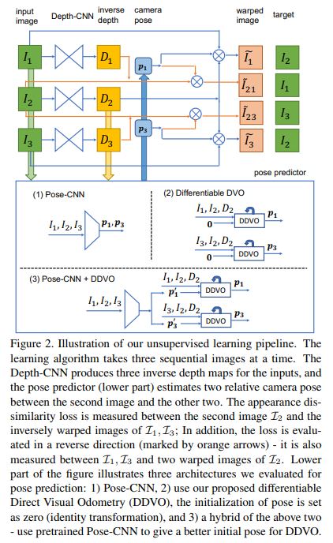

To train a depth prediction network in unsupervised way, one typically solves the following minimization problem:

$$
\min_{\theda_d, p} L_\text{ap}(f_d(I;\theta_d), p) + L_\text{prior}(f_d(I; \theta_d))
$$
where $f_d$ is depth predictor and $\theta_d$ denotes the network parameters, $p$ is relative pose and $I$ is image. What this equation says is: One wants to minimze the appearance difference by warping images according to relative pose and predicted depth (1st term) with some regularization term on predicted depth such as smootheness (2nd term). 

The following minimization represents the two-separate-network scheme:

$$
\min_{\theta_d} \min_p L_\text{ap} L_\text{ap}(f_d(I;\theta_d), p) + L_\text{prior}(f_d(I; \theta_d))
$$

which is adopted by Tingyu Zhou CVPR 17.

And this paper proposes the following scheme:

$$
\min_{\theta_d} L_\text{ap}(f_d(I;\theta_d), f_p(f_d(I;\theta_d))) + L_\text{prior}(f_d(I; \theta_d))
$$

where $f_p$ is the DDVO (a deterministic function) module which computes the optimal pose upto predicted depth. This module is parameter-free and thus does not require training. 

- Another important contribution of this paper is the depth normalization trick: To make the loss function less sensitive to scale, normalize the (inverse) depth before feeding it to loss, which is also used by LSD-SLAM for keyframe selection:

$$
\mu(d_i)\doteq \frac{N d_i}{\sum_{j=1}^N d_j}
$$

for stereo based monocular depth prediction, this might be unnecessary since the baseline of the stereo head already provides the metric scale for depth prediction.
- FIXME: study the inverse compositional method. How per iteration linearization is avoided?
- Misc: The second order minimization problem is sensitive to initialization (since 2nd-order methods model the objective as a quadratic function which is only valid in a small neighborhood of the solution), using output of Pose-CNN as initialization performs best.
    - multi-scale prediction and loss
    - 2nd smoothness: Instead of using 1st order image gradient to weight depth regularization, they use image Laplacian for the weight and 2nd derivative of depth for smooth regularization.
    - The analysis on scale ambiguity in monocular trained monocular depth estimation is valuable: Photometric error is scale invariant; but for the regularization (prior) term, small inverse depth (or large depth) is preferred by the loss since one can always decrease the smoothness term by scaling down the prediction. 
- Main references:
    - gradients of matrix pseudoinverse: [29](http://www.ci2cv.net/media/papers/deepLK-icra.pdf) Deep-KL for efficient adaptive object tracking. arXiv, 17.
    - inverse compositional algorithm: [3](https://www.ri.cmu.edu/pub_files/pub3/baker_simon_2002_3/baker_simon_2002_3.pdf)Lucas-kanade 20 years on: A unifying framework. IJCV, 04. 
    - application of inverse compositional alg. in deep learing: 
        - [4]: CLKN: Cascaded Lucas-Kanade networks for image alignment. CVPR, 17.
        - [22]: Inverse compositional spatial transformer networks. 2017.

---

### Inverse Compositional Spatial Transformer Networks

<https://github.com/chenhsuanlin/inverse-compositional-STN>

<https://chenhsuanlin.bitbucket.io/inverse-compositional-STN/paper.pdf>

CVPR 17

- Motivation: a method to learn representation invariant to spatial variation. Two existing approaches to handle spatial: data augmentation, spatial pooling and spatial transformer networks (STN):
    - data augmentation and : require an exponentional increase in the number of training samples and thus the capacity of the model to be learned. (extra burden to be spatial variation robust if not completely invarant yet) 
    - spatial pooling: can only handle small spatial variation due to the receptive field of each pooling operation
    - STN: explicitly model the spatail transformation, can handle large spatial variation with a small amount of parameters. Problem is STNs directly apply the predicted transformation to warp the feature maps and pass through the warped feature maps, which has boundary effects (in zoom out type transformation).
- Idea: IC-STN passes around the warp parameters instead of the warped feature maps compared to STN.
    - The idea of passing around the warp parameters is inspired by Lucas-Kanade algorithm which solves image alignment problem by minimizing the photometric error in an iterative way where at each iteration, the predicted warp is applied to the source image from which, together with the target image, an update is computed.
    - Essentially, this is only loosely related to LK and related to a lot of nonlinear least sqaure solvers.

#### Lucas-Kanade and the Inverse Compositional algorithm

Given source image $I$ and target/template image $T$, LK computes a warp to align the two in the sense that the following squared differences (SSD) objective is minimized:

$$
\min_{\Delta p}\|I(p+\Delta p) - T(0)\|_2^2
$$

we denote $I(p)$ as the source image $I$ warped with the parameters $p$. The LK algorithm solves this problem by iterating the following two steps: first linearize the non-linear LS at the current estimate and then solve a linear LS problem, whose solution is used to update the parameter which is then used in the next iteration.

- Linearize at the current estimate by Taylor expansion:

$$
\min_{\Delta p}\|I(p)+\frac{\partial I(p)}{\partial p} \Delta p - T(0)\|_2^2
$$

The problem of the original LK algorithm is that at each iteration, one needs to linearize the objective at the latest estimate. The Inverse Compositional (IC) algorithm is an efficient varaint of LK which instead of linearizes the source image at current estimate but linearizes the target image at identity element of the transformation group.

$$
\min_{\Delta p}\|I(p)-T(0)-\frac{\partial T(0)}{\partial p}\Delta p\|_2^2
$$

LS solution is given by the following normal equation:

$$
\Delta p=\big(J^\top J\big)^{-1}J^\top (I(p)-T(0))
$$

where $J=\frac{\partial T(0)}{\partial p}$ is the Jacobian matrix of target image at identity group element. The warp parameter is then updated as $p \leftarrow p \circ (\Delta p)^{-1}$. $\circ$ is the compose operator of the underlying transformation group.

- For the recurrent IC-STN structure, see Fig. 5 of the paper. In practice the recurrent structure is unfold into several stages as shown in Fig 4, where network parameters are shared among the warp parameter predictors.
    - In theory one needs to predict a warp, invert it and then apply the inverse warp to current warp. 
    - In practice, for end-to-end learning framework, it's better to directly predict the inverse warp and then apply it to the current estimate.

- FIXME: study the code.

---

### CLKN: Cascaded Lucas-Kanade networks for image alignment. CVPR, 17.

<http://openaccess.thecvf.com/content_cvpr_2017/papers/Chang_CLKN_Cascaded_Lucas-Kanade_CVPR_2017_paper.pdf>

CVPR 17

---

### GeoNet: Unsupervised Learning of Dense Depth, Optical Flow and Camera Pose

<https://arxiv.org/pdf/1803.02276.pdf>

CVPR 18

- Main references:
    - cost volume for stereo matching: [24]  End-to-end learning of geometry and context for deep stereo regression.
    - optical flow using rigid object prior: [54] Optical flow in mostly rigid scenes.

---

### Unsupervised Learning of Monocular Depth Estimation and Visual Odometry with Deep Feature Reconstruction

<https://arxiv.org/pdf/1803.03893.pdf>

CVPR 18

- Difference from the left-right consistency paper:
    - In addition to left-right image pairs, also consider temporal image pairs. 
    - In addition to the photometric reconstruction loss, also incorporate a feature reconstruction loss into the total loss where feature maps at early conv layers are compared. 
    - In addition to depth prediction, relative pose between two temporally consecutive images is learned in a *semi-supervised* fashion in the sense that: the stereo (left-right) pair provides ground truth metric pose and metric pose of two temporally consecutive frames is unknown in training.
- Loss: $L\text{total}=\lambda_{ir}L_\text{ir} + \lambda_\text{fr}L_\text{fr} + \lambda_\text{ds}L_\text{ds}$, where ir is image reconstruction, fr is feature reconstruction, ds is disparity smoothness. For details, see the paper.
- Network architecture:
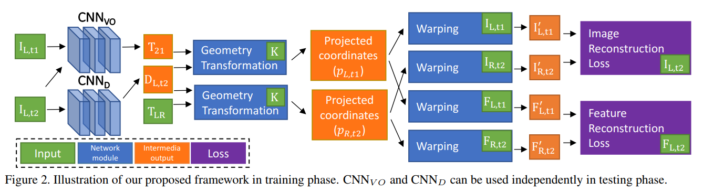
- Performance:
    - Depth: slightly better than lr consistency paper.
    - Pose: better than Tingyu Zhou CVPR17, also better than ORB-SLAM on certain KITTI sequences (dont know why ORB-SLAM performs so poorly on these sequences)
- Illustration of spatial and temporal consistency between image pairs:
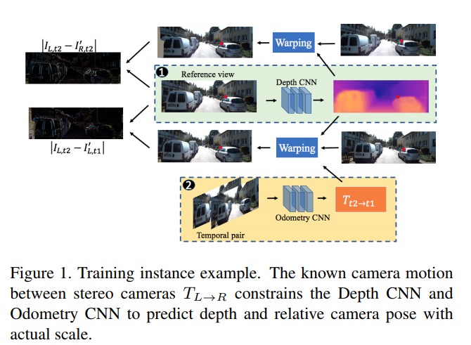

---

### Unsupervised Monocular Depth Estimation with Left-Right Consistency

<https://arxiv.org/pdf/1609.03677.pdf>

CVPR 17

- Loss: The total loss is the sum of losses at each output scale: $C=\sum_{s\in S} C_s$, where $S$ is the set of scale levels, for instance $S \doteq \{1, 2,\cdots, 4\}$. The loss $C_s$ at scale $s$ is defined as:

$$
C_s=\alpha_{ap}(C_{ap}^L+C_{ap}^R) + \alpha_{ds}(C_{ds}^L+C_{ds}^R) + \alpha_{lr}(C_{lr}^L+C_{lr}^R)
$$
where superscript $L, R$ indicates the image on which loss is computed. Basically the network only takes the left image, but predicts both left and right disparities, i.e., $d^L$ and $d^R$. We warp the left image to the right by applying $d^L$ and compute the (left) loss (with superscript L). Similarly, we warp the right image to the left by applying $d^R$ and compute the (right) loss.

loss | meaning 
---|---
$C_{ap}$ | appearance similarity
$C_{ds}$ | disparity smoothness
$C_{lr}$ | left-right consistency

- Photometric Image Loss: The photometric image reconstruction loss $C_{ap}$ is comprised of two terms: $l_1$ reconstruction error and single scale SSIM

$$
C_{ap}^L=\frac{\alpha}{|\Omega|} 
\sum_{\omega \in \Omega} 
  \frac{1-\mathrm{SSIM}(I_\omega, \tilde I_\omega)}
  {2} + 
  (1-\alpha) \| I_\omega-\tilde I_\omega\|_1
$$

where SSIM reads as:

$$
\mathrm{SSIM}(x, y) = 
\frac{(2\mu_x\mu_y+C_1)(2\sigma_{xy}+C_2)}
{(\mu_x^2+\mu_y^2+C_1)(\sigma_x^2+\sigma_y^2+C_2)}
$$

and a simplified SSIM with a $3\times 3$ block filter is used instead of a Gaussian. $\alpha=0.85$.
- Disparity Smootheness Loss: Encourage disparities to be locally smooth with an $l_1$ penalty on disparity gradients $\nabla d$. As depth discontinuities often occur at image gradients, the disparity smoothness is weighted by an edge-aware term using the image gradients $\nabla I$:

$$
C_{ds}^l= \frac{1}{|\Omega|}
\sum_{\omega \in \Omega} 
|\nabla_x d_\omega| \exp(-|\nabla_x I_\omega|) + |\nabla_y d_\omega|\exp(-|\nabla_y I_\omega|)
$$

- Left-Right Disparity Consistency Loss: Both left and right disparities are predicted given ONLY the left image. This cost attempts to make the left-view disparity map be equal to the projected right-view disparity map.

$$
C_{lr} = \frac{1}{|\Omega|}\sum_{\omega \in \Omega} \|d_\omega^L-d_{\omega + d_\omega^L}^R\|_1
$$

---

### ** 3D-RCNN: Instance-level 3D Object Reconstruction via Render-and-Compare

Abhijit Kundu, Yin Li, and James M. Rehg.

To appear CVPR 18.

---

### Feature Space Optimization for Semantic Video Segmentation

Abhijit Kundu, Vibhav Vineet, Vladlen Koltun. CVPR16.

---

## The Basics

### Spatial Transformer Networks

- The spatial transformer mechanism consists of three components:
  1. Localization network: takes the input feature map and outputs the parameters of the spatial transformation.
  2. Grid generator: takes the parameters of the spatial transformation and generates a sampling grid, based on which the input feature will be mapped to the output feature map, which is done by the *sampler*.
  3. Sampler: takes the input feature map and the sampling grid from step 1 \& 2 and produces the output feature map.

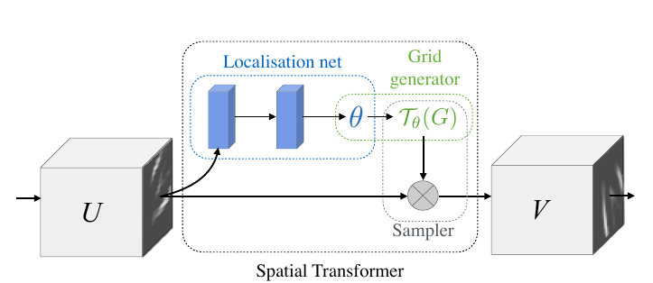
- Localization network: $\theta=f_\text{loc}(U)$ where $U\in \mathbb{R}^{H\times W \times C}$ is the input feature map and $\theta$ is the parameter of the spatial transformation. For instance, if the  transformation is affine, $\theta$ should have 6 paramters.
- Sampling grid: Let $V\in\mathbb{R}^{H'\times W'\times C}$ be the output feature map and $G=\{G_i\}$ be a regular grid of the output feature map each $G_i=(x_i^t, y_i^t)$ (superscript $t$ denotes target/output while $s$ denotes source/input). With affine transformation as an example, the relation between input grid and output grid is:
$$
\begin{pmatrix}
x_i^s\\
y_i^s
\end{pmatrix}
=
\mathcal{T}_\theta(G_i)
=
A_\theta
\begin{pmatrix}
x_i^t\\
y_i^t\\
1
\end{pmatrix}
=
\begin{bmatrix}
\theta_{11} & \theta_{12} & \theta_{13}\\
\theta_{21} & \theta_{22} & \theta_{23}
\end{bmatrix}
\begin{pmatrix}
x_i^t\\
y_i^t\\
1
\end{pmatrix}
$$

- Differentiable sampler: each $(x_i^s, y_i^s)$  in $\mathcal{T}_\theta(G)$ defines the sptial location in the input $U$ where a sampling kernel is applied to get the value at a particular pixel in the output $V$.

$$
V_i^c=\sum_n^H\sum_m^W U_{nm}^c k(x_i^s-m; \Phi_x)k(y_i^s-n;\Phi_y)\quad \forall i \in [1\cdots H'W'] \quad c\in [1\cdots C]
$$
where $\Phi_x$ and $\Phi_y$ are the parameters of a generic sampling kernel $k()$, which defines the image interpolation (bilinear, cubic, nearest neighbor ...). $U_{nm}^c$ is the value at location $(n,m)$ in channel $c$ of the input, and $V_i^c$ is the output value for pixel $i$ at location $(x_i^t, y_i^t)$ in channel $c$. In theory, any interpolation method can be used as long as the (sub)gradient of the operation can be computed. In case of bilinear interpolation:

$$
V_i^c=\sum_n^H\sum_m^W U_{nm}^c \max(0, 1-|x_i^s-m|)\max(0,1-|y_i^s-n|)
$$
and gradients:

$$
\begin{aligned}
&\frac{\partial V_i^c}{\partial U_{nm}^c}=\max(0, 1-|x_i^s-m|)\max(0, 1-|y_i^s-n|)\\
&\frac{\partial V_i^c}{\partial x_i^s}
=\sum_n^H\sum_m^W U_{nm}^c\max(0, 1-|y_i^s-n|)
\begin{cases}
0 &\text{if } &|m-x_i^s| \ge 1\\
1 &\text{if } &m \ge x_i^s\\
-1 &\text{if } &m < x_i^s
\end{cases}
\end{aligned}
$$
and similar for $\frac{\partial V_i^c}{\partial y_i^s}$.

---

### Generative Adversarial Nets

<https://papers.nips.cc/paper/5423-generative-adversarial-nets.pdf>

---

### Auto-Encoding Variational Bayes

<https://arxiv.org/pdf/1312.6114.pdf>

---

### Stochastic Backpropagation and Approximate Inference in Deep Generative Models

<https://arxiv.org/pdf/1401.4082.pdf>

---

### An Introduction to Variational Methods for Graphical Models 

<https://people.eecs.berkeley.edu/~jordan/papers/variational-intro.pdf>

#### Exact inference
- The junction tree algorithom compiles directed graphical models into undirected graphical models in two steps:
    1. moralization: convert the directed graph into an undirected graph(marry parents of each node and remove the direction of edges). 
    2. triangulation: add additional edges to the moral graph such that recursive calculation of probabilities can be performed on the resulting graph
- Subsequent inferential calculation is carried out in the undirected formalism, whose time complexity depends on *the size of the cliques*; 
    - in particular for discrete data the number of values required to represent the potential is exponential in the number of nodes in the clique. 
    - For efficient inference, it is therefore critical to obtain small cliques.

#### Examples
- QMR-DT (disease) database: $d$ is disease and $f$ is sympton (feature). Both are binary random variables.

$$
P(f,d)=P(f|d)P(d)=\big(\prod_i P(f_i|d)\big) \big(\prod_j P(d_j) \big)
$$
where $P(f_i=0|d)=\exp\big(-\sum_{j\in \pi_i} \theta_{ij}d_j - \theta_{i0}\big)$ and 
$P(f_i=1|d)=1-\exp\big(-\sum_{j\in \pi_i} \theta_{ij}d_j - \theta_{i0}\big)$.

- Neural Networks as graphical models: use sigmoid as activation and treat the activation as the probability of the node beging in state 1. Each node is treated as a binary random variable.

$$
p(S_i=1|S_{\pi_i}) = \frac{1}{1+\exp(-\sum_{j\in\pi_i} \theta_{ij}S_j - \theta_{i0})}
$$

- Bolzmann machines: the clique potentials are formed by taking products of Bolzmann factors -- exponential of terms that are at most quadratic in the $S_i \in \{0, 1\}$. A given pair of nodes can *appear in multiple, overlapping cliques*. For each such pair we assume that *each distinct expression appears as a factor in one and only one clique potential*.

$$
P(S) = \frac{1}{Z}\exp(\sum_{i< j} \theta_{ij}S_iS_j + \sum_{i}\theta_{i0}S_i)
$$

where $\theta_{ij}=0$ means nodes i and j are not neighbors in the graph. Negative of the exponent in above equation is called *energy* and a distribution with the above density is called a *Bolzmann distribution*.

#### Variational inference
- Sequential methods: One can sequentially replace some nodes in the original graph with emergent nodes from approximation (via convex duality). 
- Block methods: One can also use a distribution family with good properties to approximate the original distribution.
- Examples of using such approximate inference methods are given in the paper.
- See the paper for details.

---

### Uncertainty in Deep Learning

<http://mlg.eng.cam.ac.uk/yarin/thesis/thesis.pdf>

PhD Thesis

---

## Unsupervised discovery of landmarks

This section contains a list of papers related to unsupervised landmark/2d-3d correspondence discovery.

### Single Image 3D Interpreter Network

Jiajun Wu, ECCV 16.

- 3 stage training:
    - 2d keypoint detection with keypoint annotation on real images as supervision
    - skeleton model parameter regression with (rendered keypoints, parametrized skeleton model) pairs as supervision
    - end-to-end training of the complete pipeline with projection layer at the end of the network
- Datasets: 
    - Pascal3D, Yu Xiang
    - FLIC for human bodies: Multimodal decomposable models for human pose estimation
    - CUB-200-2011 for birds: The Caltech-UCSD Birds-200-2011 Dataset
    - Keypoint-5: own dataset
- Keypoint detection:
    - FLIC: Percentage of Correct Keypoints (PCK), [35,45,44] [44] has toolkits for evaluation
    - CUB-200-2011: Percentage of Correct Parts (PCP) and Average Error (AE), [26, 38], [26] provides the evaluation code
- Structural parameter estimation:
    - Quantitative: 
        - [61] convex relaxation, Xiaowei Zhou
        - [25] IKEA dataset
    - Qualitative:
        - Keypoint-5, IKEA, SUN

---

### 3D Shape Estimation from 2D Landmarks: A Convex Relaxation Approach

Xiaowei Zhou, CVPR 15.

- Nonrigid structure from motion (NRSfM) via matrix factorization + metric rectification [9, 39]; recent iterative methods [29, 15, 2]
- Model: 
    - Weak perspective projection: simply ignore depth component (or assume depth variation over the object surface is negligible compared to the distance between the object and the camera)
    - Shape as a linear combination of basis shapes, each of which is composed of a fixed number of (predefined) landmarks in a canonical reference frame. One needs to also estimate the rigid body transformation to algin the canonical reference frame to the camera frame, in addition to the coefficients of the linear combination.
    - The basis shapes form an over-complete dictionary of shapes (in contrast to earlier works where only a small set of shapes is considered). To ensure only a small set of shapes is selected from the over-complete dictionary, l1 norm on the coefficients is imposed as regularization.
- Input is 2d landmarks with known 3d association, i.e., the data association problem is not solved in this paper.

---

### Learning Dense Correspondence via 3D-guided Cycle Consistency

---

### Unsupervised learning of object landmarks by factorized spatial embeddings

<http://openaccess.thecvf.com/content_ICCV_2017/papers/Thewlis_Unsupervised_Learning_of_ICCV_2017_paper.pdf>

James Thewlis, ICCV 17.

- TPS (Thin plane spline) is used in [30] WarpNet: weakly supervised matching for single-view reconstruction. 
- Relation to existing landmark detection algorithm: this work can build on top of existing detectors and can be used as a pre-training strategy to learn landmarks with no or less supervision. -- How to understand this statement? 
- Equivariance constraint: [37] Learning covariant feature detectors. TODO: read this one.

Method is very interesting. Let $S \subset \mathbb{R}^3$ be the surface of an object which is potentially subject to deformation and rigid pose transformation. Let $\Phi: \mathbb{R}^3 \mapsto \mathbb{R}^2$ be a mapping from the surface to image domain. Essentially, $\Phi$ should be shape-specific, thus we associate it with $S$ as subscript, i.e., $\Phi_S$. However, since only the image of the object $I: \mathbb{R}^2 \mapsto \mathbb{R}_+$ but not the underlying shape is known, $\Phi_S$ is parameterized by the image, i.e., $\Phi_S(\cdot; I)$. Now assume the image $I'$ differs $I$ by a domain transformation/warp $W: \mathbb{R}^2\mapsto \mathbb{R}^2$, for the same surface point $X\in S$, we have its coordinates in image $I$: $x=\Phi_S(X; I)$ and in image $I'$: $x'=\Phi_S(X; I'=I\circ W)$ and the two image coordinates are related by $x'=W(x)$. Therefore, we have the following equivaraince constraint:

$$
\Phi_S(X; I) = W\big( \Phi_S(X; I\circ W) \big).
$$

Image pairs as long as the domain warp are needed in training. They construct the training set by warping each image via a randomly generated transformation $W$, thus they have both the image pair and warp.

- The equivariance constraint is a generalization of the relation between images of points on static rigid bodies. It is related to the reprojection error in unsupervised learning of depth/flow/disparity prediction.
    - TODO: write down the explicit relation.

- In the paper, it is claimed that the learned landmarks are consistent across different instances of the same category and qualitative results are present. However, from the figure, it seems even though the intra-category shape variability is large, the viewpoint change is very small. 
    - SHOULD PLAY WITH THEIR MODEL ON OBJECTS AT POSES DIFFERENT FROM THOSE SHOWN IN THE PAPER.
- The method is also compared to supervised landmark detectors. To do that, an extra regressor is trained to map the detected landmarks (unsupervised learned, may not have semantic meanings) to ground truth landmarks annotated in the dataset. Detection accuracy/error is comparable to state-of-the-art supervised methods, but does NOT outperform strong baselines.

- Come back for the effective implementation of loss.
- Code is not available (?) -- could play with this with tensorflow.

- TODO: read those which cite this one.

---

### Unsupervised Discovery of Object Landmarks as Structural Representations

<https://arxiv.org/pdf/1804.04412.pdf>

Yuting Zhang, CVPR 18.

- Drawback of Thewlis is: 
    - Their method did not explicitly encourage the landmarks to appear at critical locations for image modeling.
    - Non-differentiable? (go back to Thewlis)
- TODO: Look at WarpNet, which is mentioned by both this and Thewlis
- In addition to keypoints, feature maps are also extracted. Both the geometric (keypoints) and photometric (feature maps) are used to reconstruct the image, which is involved in the reconstruction error. This is meaningful for applications like image reconstruction, but not really useful for pose estimation, where geometry is the only concern, NOT appearance.
- Other losses include the equivariance loss and separance loss, which are also used by Thewlis, and concentration loss which penalizes spatial variance of each landmark.
- Check out the arXiv version of the paper (48 pages) which contains a lot of details on training and qualitative results in the appendix.

---

### Unsupervised learning of object frames by dense equivariant image labelling

<http://papers.nips.cc/paper/6686-unsupervised-learning-of-object-frames-by-dense-equivariant-image-labelling.pdf>

James Thewlis, NIPS 17.

- Related work: [44] Deep Deformation Network: improves over WarpNet by using a *Point Transformer Network*
- Goal is to learn a labelling function $\Phi: (I, u) \mapsto z$, where 
    - $I:\mathbb{R}^2 \mapsto \mathbb{R}^3_+$ (in case of RGB images, or the more familiar form of $\mathbb{R}^2\mapsto \mathbb{R}^2_+$ for grayscale images);
    - $u \in \mathbb{R}^2$ is image coordinates and
    - $z \in \mathcal{Z} \subset \mathbb{R}^3$ is a point on 3D sphere $\mathcal Z$ whose image is $u$
- Additional notataions include $S\subset \mathbb{R}^3$ is the surface of the object; $\pi_S: S \mapsto \mathbb{R}^2$ is a homeomorphism mapping points on sphere $\mathcal Z$ to object surface $S$. For different instances of the same category, we have a semantically consistent mapping: $\pi_{S'}\circ \pi_S^{-1}: S\mapsto S'$
- Eq. 3: defines conditional probability of "keypoint" location in one image given the that in the other
- Eq. 4: naive loss evaluates the cross entropy
- Eq. 5: actual loss also takes the difference of the predicted "keypoint" locations into consideration. If conditional probability is small, u and v are not correlated, then even if the difference between v and gu are big, we don't care; if conditional probability is big, we penalize the difference between v and gu more.
- For real image, g is obtained by optical flow. For synthetic image pairs, ground truth g can be obtained.
- Come back to the loss when needed.

---

### Statistical transformer networks: Learning shape and appearance models via self supervision

<https://arxiv.org/pdf/1804.02541.pdf>

Anil Bas, arXiv

Paper seems not so interesting.

---

### WarpNet: weakly supervised matching for single-view reconstruction

<https://arxiv.org/pdf/1604.05592.pdf>

Angjoo Kanazawa, CVPR 16.

An approach to matching images of objects in fine-grained datasets without using part annotations, with an application to the challening problem of weakly supervised single-view reconstruction.

Difficulty: matching objects across class and pose variations is challenging with appearance features along.

To overcome the difficulty, WarpNet aligns an object in one image with a different object in another (semantic correspondence).

- TPS [5] to transform images of non-rigid objects, since affine transformation is insufficient to capture non-rigidity
    - In other words, if the objects are rigid, we can use affine transformation.
    - The weights of the TPS transformation in this is learned from the dataset. Sect. 3.1
    - Transformations are sampled from the distribution over all possible TPS transformations, and applied to the image to generate its counterpart for training.
- Generate artificial correspondences by applying known transformations [1]

- Reconstruction: with correspondence propagation over potentially different instances of the same category at different poses within a neighborhood of the similarity graph by [...] check the paper on graph construction.

- Once the correspondences are obtained, reconstruct using [21]: Estimating 3D shape from degenerate sequences with missing data.

---

### Discriminative unsupervised feature learning with convolutional neural networks

<https://papers.nips.cc/paper/5548-discriminative-unsupervised-feature-learning-with-convolutional-neural-networks.pdf>

Alexey Dosovitskiy, NIPS 14.

---

### Learning covariant feature detectors

<https://www.robots.ox.ac.uk/~vgg/publications/2016/Lenc16/lenc16.pdf>

Karel Lenc, ECCV 16 workshop.

- Invariant descriptor
- Covariant detector: Detect image structures (such as blobs, corners) preserved under a viewpoint change.

Covariant constraint: 

$$
\psi(gI) = g\big(\psi(I)\big)
$$

where $I:\mathbb R^2\mapsto \mathbb R_+$ maps image domain to intensity values and $g$ is a group element which transforms the image; $\psi: \mathcal I\mapsto \mathcal F$ models the detector which is a functional maps images to feature frames (in the simplistic case, feature frame $\mathcal F \subset \mathbb R^2$ ).

The action $gI$ of the transformation $g$ on the image $I$ is to warp it: $(gI)(u, v)=I(g^{-1}(u,v))$. Let $W: \mathbb R^2 \mapsto \mathbb R^2$ be the warp induced by the group element $g$, then the covariant constraint reads:

$$
\psi(I\circ W^{-1}) = W\big(\psi(I)\big).
$$

The above constraint is equivalent to the one in Thewlis, though the notations are slightly different. In Thewlis, $\Phi(I)=W\big(\Phi(I\circ W)\big)$, replace $W$ with $W^{-1}$ and move the enclosing $W$ on RHS to LHS, we get $W(\Phi(I))=\Phi(I\circ W^{-1})$, which is exactly the same constraint.

- Most detectors are in fact covariant with transformation groups larger than the ones that they can resolve. General analysis can be found in Section 2.3.

- Training involves triplets of the following: 
    - image patch
    - a transformation
    - a second image patch obtained by applying the transformation to the first image patch

---

### PoseCNN: A Convolutional Neural Network for 6D Object Pose Estimation in Cluttered Scenes

[paper](https://arxiv.org/pdf/1711.00199.pdf)

[code](https://github.com/yuxng/PoseCNN)

Yu Xiang, RSS 2018.

The two references in the [project page](https://rse-lab.cs.washington.edu/projects/posecnn/) are interesting:
1. B. Calli, A. Singh, A. Walsman, S. Srinivasa, P. Abbeel, and A. M. Dollar, “The YCB object and model set: Towards common benchmarks for manipulation research,” in International Conference on Advanced Robotics (ICAR), 2015, pp. 510–517.
2. A. Krull, E. Brachmann, F. Michel, M. Ying Yang, S. Gumhold, and C. Rother, “Learning analysis-by-synthesis for 6D pose estimation in RGB-D images,” in IEEE International Conference on Computer Vision (ICCV), 2015, pp. 954–962.

3D-2D correspondence for pose estimation paper:
1.  Learning 6D object pose estimation using 3D object coordinates
2.  Uncertainty-driven 6D pose estimation of objects and scenes from a single RGB image
3.   Learning analysis-by-synthesis for 6D pose estimation in RGB-D images

---

### Deep Supervision with Shape Concepts for Occlusion-Aware 3D Object Parsing

Chi Li, CVPR 17.

Use a lot of synthetic data to train the model. Different concepts including 2D keypoints, 3D keypoints, keypoint visibility, viewpoint are learned in a deeply supervised way.

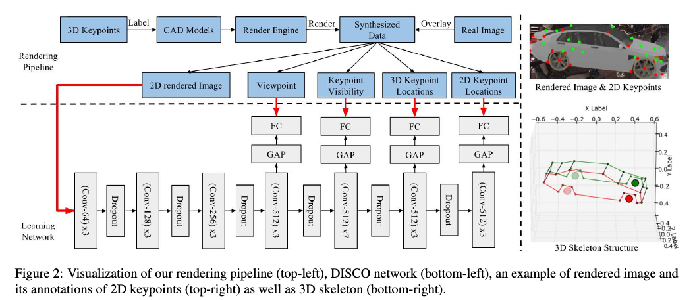

---

SyncSpecCNN

- functional map [20,24]

---

### Thoughts on unsupervised 2D-3D correspondence seeking
1. The equivariance constraint proposed by Thewlis can still be used but with restricted transformation. Since we concern rigid bodies, the warp can only be perspective, which we can exploit.
2. In addition to point features, we can use line (segment) features.

