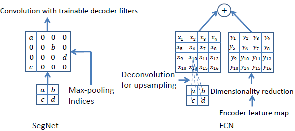
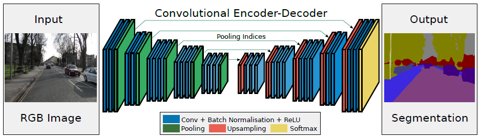
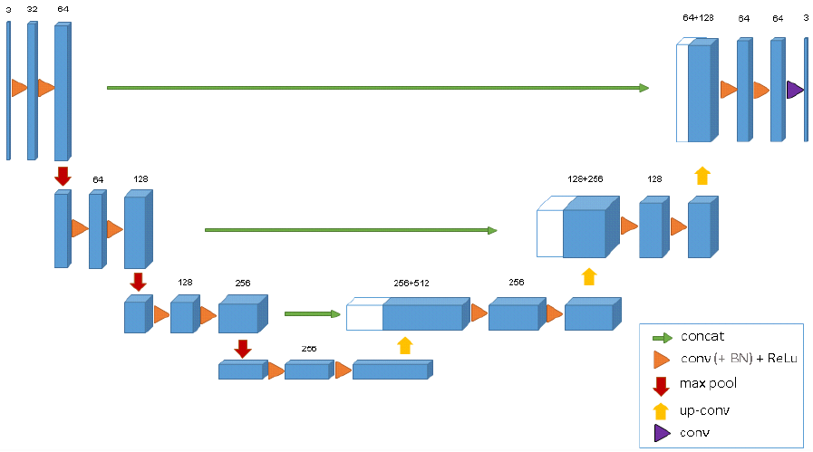
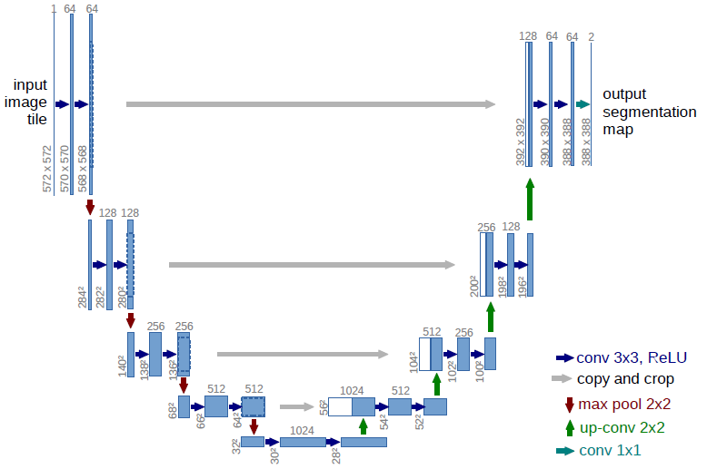

## SegNet: A deep convolutional encoder-deconder architecture for image segmentation

- Remember pooling indices during max-pooling to perform non-linear upsampling, eliminate the need for learning to upsample.
  - According to the description in the pytorch documentation, this operation is essentially unpooling -- non-maximal entries will be filled with zero.
  - Terms 'Unpooling' and 'Upsampling' can be used exchangeably.
  - A different technique to increase size of feature map used by FCN is deconvolution.


- Similar to DeconvNet, which also applies this unpooling idea. But this work discards the fully connected layer present in the VGG net, which is inherited by DeconvNet. For a comparison of the architecture of SegNet and U-Net, see the text just above section 3.1.
```
It is necessary to capture
and store boundary information in the encoder feature maps
before sub-sampling is performed. If memory during inference
is not constrained, then all the encoder feature maps (after subsampling)
can be stored. This is usually not the case in practical
applications and hence we propose a more efficient way to store
this information. It involves storing only the max-pooling indices,
i.e, the locations of the maximum feature value in each pooling
window is memorized for each encoder feature map. In principle,
this can be done using 2 bits for each 2  2 pooling window and
is thus much more efficient to store as compared to memorizing
feature map(s) in float precision.
```


- Conclusion: feeding entire feature maps from the encoder to decoder has best performance; SegNet approach is more memory efficient and has competitive performance on benchmarks.

---

## 3D U-Net: Learning dense volumetric segmentation from sparse annotation

- Focus on segmentation of medical imagery, which is usually volumetric.
- Two modes:
  - semi-automated mode: Given annotations on some slices of the volumetric data, the network learns and produces dense 3D segmentation.
  - fully-automated mode: The offline trained network densely segments new volumetric images.
- This is an extension to the u-net architecture from:
  - U-net: Convolutional networks for biomedical image segmentation
- Architecture:
  - Two paths: analysis and synthesis each with four resolution units.
  - Analysis/contracting path: Each unit consists of two convolutions each followed by ReLU; between two consecutive units, there is a stride two max pooling layer.
  - Synthesis/expansive path: Each unit contains two convolutions each followed by ReLU. Between units, there is an upconvolution layer which increase resolutions.
  - Shortcut connections from units of equal resolution in the analysis path provide high-resolution features to the synthesis path.
  - Last layer contains a dimension 1 filter which reduces the number of output channels to the desired dimension. (number of labels in the case of multi-label segmentation)



---

## U-net: Convolutional networks for biomedical image segmentation

- Network and training strategy that relies on the *strong use of data augmentation to use the available annotated samples more efficiently*.
- This work is built upon FCN, while FCN extracts some feature maps from the analysis/contracting path, upsamples and stacks them to form a feature vector, on which a (non-)linear classifier can be applied to make pixelwise prediction.
- Architecture:
```
It consists of a contracting
path (left side) and an expansive path (right side). The contracting path follows
the typical architecture of a convolutional network. It consists of the repeated
application of two 3x3 convolutions (unpadded convolutions), each followed by
a rectied linear unit (ReLU) and a 2x2 max pooling operation with stride 2
for downsampling. At each downsampling step we double the number of feature
channels. Every step in the expansive path consists of an upsampling of the
feature map followed by a 2x2 convolution (\up-convolution") that halves the
number of feature channels, a concatenation with the correspondingly cropped
feature map from the contracting path, and two 3x3 convolutions, each fol-
lowed by a ReLU. The cropping is necessary due to the loss of border pixels in
every convolution. At the nal layer a 1x1 convolution is used to map each 64-
component feature vector to the desired number of classes. In total the network
has 23 convolutional layers.
```


---

## Thoughts on network architecture after reading SegNet

- All have two path: encoder and decoder (or contracting and expansive, or analysis and synthesis).
- Encoder structure more or less the same (all use VGG except U-Net).
- Remove the fully connected layer used in VGG can reduce the number of parameters significantly (DeconvNet keeps the fully connected layer while SegNet removes it).
- Several variants of decoder:
  - Feed the entire feature map from the analysis path to the synthesis path (best performance, the U-Net approach)
  - Feed the max-pooled feature map to the synthesis path and upsample the feature map to match size of feature map (memory efficient and fast, the SegNet approach)

---

## UberNet : Training a ‘Universal’ Convolutional Neural Network for Low-, Mid-,
and High-Level Vision using Diverse Datasets and Limited Memory

Interestingly, instead of the encoder/decoder paradigm, UberNet basically
- builds an image pyramid and
- feed each layer of the pyramid to an identical network (first several layers of VGG?)
- extract feature maps from several layers, stack them and
- apply task specific modules which have their own paramters (classifiers? )


---

## PixelNet: Representation of the pixels, by the pixels, and for the pixels

Learns learned:
  - Sampling pixels is not as efficient as always operating on the entire feature map -- at least with python implementation of the sampling and indexing operations, it's not as fast as the plain hypercolumn architecture.
  - For the considerations of saving memory, sampling pixels might help in the sense that PixelNet only handles a handful of feature maps in every minibatch, which makes it feasible to apply MLP atop hypercolumns.
