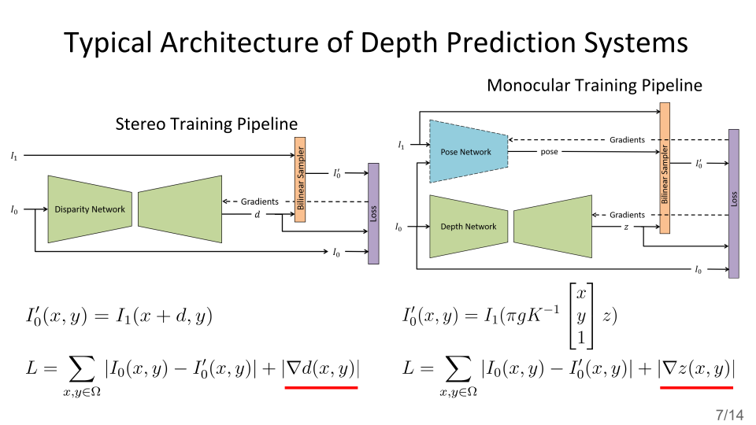
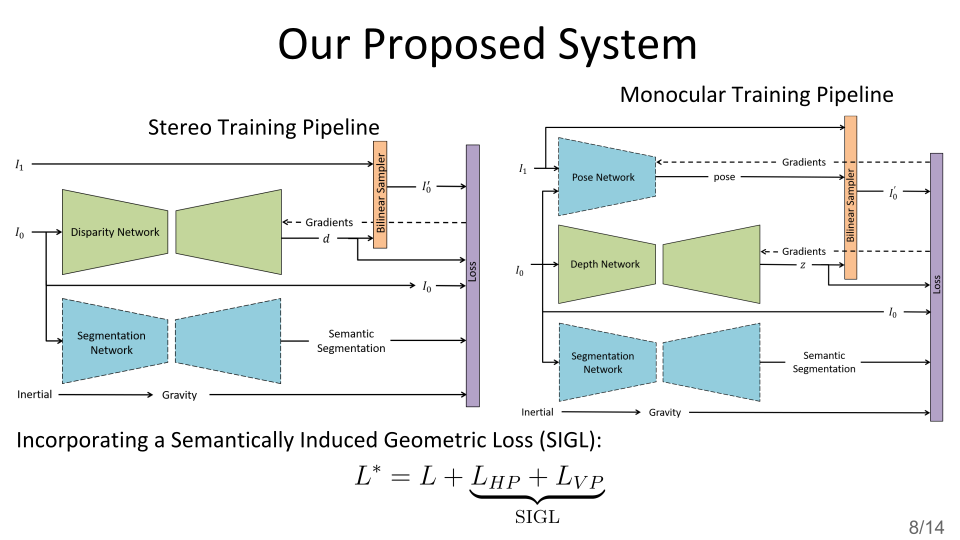

[Xiaohan Fei](https://feixh.github.io), [Alex Wong](http://web.cs.ucla.edu/~alexw/), and [Stefano Soatto](http://web.cs.ucla.edu/~soatto/)

[UCLA Vision Lab](http://vision.ucla.edu/)

We propose using global orientation from inertial measurements, and the bias it induces on the shape of objects populating the scene, to inform visual 3D reconstruction. We test the effect of using the resulting prior in depth prediction from a single image, where the normal vectors to surfaces of objects of certain classes tend to align with gravity or be orthogonal to it. Adding such a prior to baseline methods for monocular depth prediction yields improvements beyond the state-of-the-art and illustrates the power of gravity as a supervisory signal.

\[[paper][icra19_paper]\]-\[[poster][icra19_poster]\]-\[[slides][icra19_slides]\]-\[[code][icra19_code]\]

[icra19_paper]: https://arxiv.org/abs/1807.11130v3.pdf
[icra19_poster]: https://docs.google.com/presentation/d/15iNPC1V6dx52CqyeNivtYySM-cqvE0ghAH9C8Tzd6yQ/edit?usp=sharing
[icra19_slides]: https://docs.google.com/presentation/d/1okyWsSpKIzcbfvCD8VkkuLlcV8cHKxxQKH4Xy2JSPOQ/edit?usp=sharing
[icra19_code]: https://github.com/feixh/GeoSup

---

Typical self-supervised depth prediction systems learn to predict depth by minimizing a photometric loss, known as the data term in the variational optimization literature, and a generic regularizer -- usually a local smoothness term (marked in red in the figure below). The figure below shows two typical training pipelines in both stereo and monocular settings.

---

Given enough examples, the model hopefully will learn the correlation of shapes and gravity for some objects, for instance, buildings tend to be normal to the ground plane, and roads are orthogonal to gravity. 

*But why do we want to learn these priors if we already know?*

By introducing the *semantically informed geometric loss (SIGL)* and an off-the-shelf semantic segmentation module in training time, we are able to impose such priors to the model, and greatly reduce the training samples needed while achieve better performance than baseline models without such priors. The figure below shows how we do so in both stereo and monocular training settings.

---

SIGL consists of two terms: $$L_{HP}$$, applied to horizontal planes such roads and sidewalks, and $$L_{VP}$$ applied to vertical planes such as walls and fences. In short, $$L_{HP}$$ penalizes the deviation of surface normals from the direction of gravity, and $$L_{VP}$$ penalizes the deviation of surface normals from the direction orthogonal to gravity. The figures below illustrate them.

---

The following figures show head-to-head comparisons to top-performing baseline models on both outdoor (KITTI) and indoor (our visual-inertial and depth) datasets, stereo (Godard *et al.*) and monocular (Yin *et al.*) training settings.

For more details of our system and experiments, please see the [slides][icra19_slides] and the [paper][icra19_paper].
